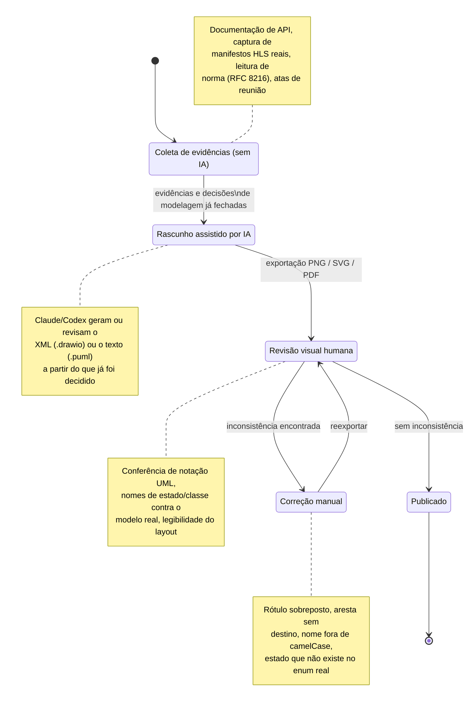

# FOCO_03 — IA Generativa (SubEquipe_01)

**Entrega mínima do foco:** pontos de vista de cada membro sobre as lições aprendidas e o uso de IA Generativa. **Todos os membros devem participar.**

Este foco existe porque a própria decisão **D01** da [Ata S1_01](/Projeto/Atas/Atas_Sg1/ata-S1-01-2026-09-15.md) recomendou o PlantUML como ferramenta principal **por ter integração com IA**, e a decisão **D05** pediu explicitamente que esse uso ficasse registrado com senso crítico — não como nota de rodapé, mas como parte auditável do processo. Por isso, esta página não é uma declaração genérica de "usamos IA no projeto": é um recorte de **onde, especificamente, cada ferramenta foi chamada, o que ela produziu e o que precisou ser corrigido depois**. A coleta de evidências do FOCO_01/FOCO_02 foi trabalho humano. No A05, Heitor elaborou o conteúdo e as decisões de modelagem diretamente em PlantUML, enquanto o Codex apoiou posteriormente a revisão técnica, a validação da sintaxe, a integração documental e a preparação do PR.

## Metodologia do Foco

A **SubEquipe_01** usou IA generativa como **ferramenta de apoio à representação e à revisão** dos artefatos — geração e ajuste de XML de diagramas, revisão de consistência UML e validação de sintaxe — e **nunca** como fonte de evidência ou de decisão de modelagem. A coleta das evidências dos FOCO_01/FOCO_02 (documentação de API, manifestos HLS capturados no navegador, RFC 8216, atas) e as decisões `DE01`–`DE10` foram trabalho humano; a IA entrou depois, quando o que modelar já estava fechado.

### Ferramentas utilizadas

| Ferramenta | Quem usou | Para quê |
| -- | -- | -- |
| Claude (Anthropic), via Claude Code | Lucas Andrade Zanetti, Pedro Druck Montalvão Reis | Geração e ajuste iterativo do XML `.drawio` (diagrama de sequência de Clipagem, Diagrama de Componentes e Diagrama de Máquina de Estados) |
| Codex | Heitor Macedo Ricardo | Revisão técnica do Draw.io v3 e do A05 (PlantUML), validação de sintaxe e renderização, integração documental e preparação de PR |

### Papel da IA no fluxo de trabalho

1. **Geração da representação gráfica:** geometria de lifelines, componentes e estados, roteamento de conectores e montagem das tabelas de evidência, a partir de decisões e evidências já registradas;
2. **Revisão de consistência:** conferência de notação UML (visibilidade, multiplicidade, camelCase, aresta sem destino) e de sintaxe PlantUML;
3. **Integração documental:** organização das páginas de evidência, exportação `.puml` → SVG/PNG e preparação de PR.

### Critérios de validação e salvaguardas

- **Evidência antes da IA:** a IA não leu a documentação da plataforma nem definiu decisões de domínio (ex.: o evento `RecordingAvailable`); cada elemento não trivial continua ligado a uma evidência (🟢) ou marcado como decisão de projeto (🟡), conforme o [critério de "pronto"](/Base/Relatórios/1.1.1.SubEquipe_01/1.1.1.4.Metodologia.md);
- **Inspeção visual humana a cada exportação:** nenhum diagrama gerado por IA foi publicado sem abrir o PNG/SVG e conferir a legibilidade;
- **Conferência contra o modelo real:** nomes de estado, classes e guardas foram checados contra as enumerações e classes do FOCO_01 (checklist nº 3 da [Metodologia](/Base/Relatórios/1.1.1.SubEquipe_01/1.1.1.4.Metodologia.md)), e não pela aparência do diagrama;
- **Revisão entre pares e autoria individual:** coautoria registrada por `Co-authored-by` e commits em nome de quem escreveu o conteúdo (decisão D04 da [Ata S1_01](/Projeto/Atas/Atas_Sg1/ata-S1-01-2026-09-15.md)).

## Participantes no Foco_03

| Nome do Membro | Lições Aprendidas | Uso da IA Generativa (senso crítico) |
| -- | -- | -- |
| Lucas Andrade Zanetti | Gerar um diagrama de componentes e uma máquina de estados **por script** (montando o XML do `.drawio` em Python a partir das decisões e evidências já registradas) obriga a formalizar antes as regras de layout e nomenclatura — e isso expôs inconsistências entre artefatos que passariam despercebidas numa montagem manual: o estado `CONFIGURING` do diagrama de sequência não existe na enumeração `LiveStreamStatus` do modelo estático v2 (que usa `CREATED`); o desfecho `BLOCKED` citado no FOCO_02 também não está na enumeração; e `LiveStreamStatus` encolheu de 7 valores (decisão DE07, v1) para 4 (v2) sem que isso tivesse sido registrado em nenhuma página. Nenhuma dessas três divergências apareceria só de olhar cada diagrama isoladamente. | Usei Claude (via Claude Code) para gerar e ajustar iterativamente o XML dos diagramas de componentes e de estados — não para decidir *o que* modelar (isso veio das decisões DE01–DE10 do FOCO_01 e das evidências E1–E13/F02-E1–E11 já coletadas por mim e pelos colegas), mas para produzir a representação gráfica: geometria dos componentes/estados, roteamento automático de conectores entre camadas, e a montagem das tabelas de evidência por página. Em nenhuma das duas iniciativas o primeiro resultado exportado ficou pronto: cada rodada de exportação em PNG mostrou problema visual concreto — rótulos de transição sobrepostos ao próprio estado, um pseudoestado inicial encostado no título da região, uma seta de sinal cruzando por cima de outro subsistema no consolidado — e cada um desses problemas exigiu ajuste manual (reposicionamento, mudança de `exitX`/`exitY`, deslocamento de rótulo) antes da publicação. O aprendizado central: IA generativa acelera a *geração* e a *correção pontual* de um artefato visual, mas não substitui a inspeção visual humana da legibilidade final. |
| Matheus Lemes Amaral | Entrar como coautor de um artefato que outra pessoa começou — o esqueleto do diagrama de classes (v1, Lucas) e, depois, o subsistema C1 e a máquina M1 gerados por IA a partir do que a subequipe já tinha decidido — deixou claro que aceitar uma coautoria exige revisar o conteúdo linha a linha antes de assinar, e não só concordar com o resultado visual. Na revisão de UGC/clipagem com Pedro (PR #5), corrigir o papel do `ContentRepository` e o estado de `ClipRequestStatus` só foi possível porque os dois conferiram o texto contra o que fora combinado em reunião, não contra a aparência do diagrama. | Não usei IA generativa diretamente para gerar diagramas nesta entrega; minha parte foi de revisão. Primeiro, revisando com Pedro Druck o pacote de UGC/clipagem já modelado por Lucas (sem IA nessa etapa). Depois, como coautor do subsistema C1 (Diagrama de Componentes) e da máquina M1 (Diagrama de Máquina de Estados), que foram gerados com apoio de Claude Code por Lucas: o ponto crítico do meu papel ali foi conferir se os nomes de estado (`NOT_ELIGIBLE`, `ELIGIBLE`, `SUSPENDED`, `ACTIVE`/`EXPIRED`/`REVOKED`) e as guardas batiam com o `CreatorProfile` e o `IngestCredentials` do modelo estático real, e não aceitar a geração automática só porque o desenho parecia coerente. |
| Pedro Druck Montalvão Reis | Modelar o fluxo de Clipagem deixou explícito que operações aparentemente simples (recortar e transcodificar um trecho de vídeo) não podem ser tratadas como síncronas no diagrama — precisam de um disparo assíncrono e de um mecanismo de consulta de status; sem isso, o modelo ficaria irrealista. | IA generativa (Claude, via Claude Code) foi usada como ferramenta de apoio para montar e iterar o XML do diagrama de sequência em draw.io (lifelines, barras de ativação, fragmentos `alt`/`loop`, legenda) — ver detalhes na linha 3 do registro abaixo. O fluxo modelado, os nomes das operações e as decisões de escopo foram definidos e revisados pela dupla; a ferramenta não teve acesso a nenhuma evidência real de uma plataforma de clipagem, então o resultado é assumido como um modelo ilustrativo, não uma engenharia reversa. |
| Heitor Macedo Ricardo | Modelar o A05 (Transmissão ao vivo) direto em PlantUML, por texto, tornou a revisão por *diff* muito mais simples do que comparar duas imagens de um `.drawio` — mas exigiu atenção redobrada com a sintaxe: um fragmento `alt` mal fechado ou uma seta de retorno sem a lifeline correta só aparecem como erro na hora de renderizar, não durante a escrita. | Elaborei manualmente o conteúdo, o fluxo e as decisões do A05 a partir das evidências E4, E6, E7, E8 e E11. O Codex não gerou o diagrama, mas apoiou sua revisão técnica, validação de sintaxe e renderização, verificação de consistência com os demais artefatos, integração à documentação e preparação do PR #10. Também usei o Codex para revisar o Draw.io v3 antes do PR #8; nessa revisão foram identificadas inconsistências como `NetworkMetrics` sem definição, nomes fora de camelCase, problemas de visibilidade e multiplicidade e uma aresta sem destino, corrigidas antes da publicação. |

## Pontos de vista individuais aprofundados

Cada integrante detalha abaixo o escopo trabalhado, um acerto e um erro/correção concretos e o comprobatório no Git. Os relatos preservam a autoria pessoal e não repetem o que já está no [registro de uso](/Base/Relatórios/1.1.1.SubEquipe_01/1.1.1.3.Foco03.IAGenerativa.md#registro-de-uso-de-ia-generativa) — aqui o foco é o julgamento sobre o que a ferramenta entregou.

### Lucas Andrade Zanetti

| Campo | Conteúdo |
| -- | -- |
| Membro | **Lucas Andrade Zanetti** ([@Bappoz](https://github.com/Bappoz)) |
| Escopo trabalhado | Diagrama de classes — componente *Serviço de domínio* e integração (FOCO_01); diagrama de sequência de UGC (FOCO_02); iniciativas extras [Diagrama de Componentes](/Base/Relatórios/1.1.1.SubEquipe_01/1.1.1.9.Extra.DiagramaComponentes.md) (C1–C4) e [Diagrama de Máquina de Estados](/Base/Relatórios/1.1.1.SubEquipe_01/1.1.1.10.Extra.DiagramaEstados.md) (M1–M4) |
| Lições aprendidas | Gerar os dois diagramas extras por script obriga a formalizar antes as regras de layout e nomenclatura, e isso fez aparecer inconsistências entre artefatos que a montagem manual esconderia: `CONFIGURING` (sequência) inexistente em `LiveStreamStatus`, `BLOCKED` (FOCO_02) fora da enumeração e o encolhimento de `LiveStreamStatus` de 7 para 4 valores sem registro. Consistência entre artefatos só se vê quando se tenta derivar um do outro. |
| Uso da IA Generativa (senso crítico) | Claude Code produziu a representação (geometria, roteamento, tabelas), não as decisões: o que modelar veio de `DE01`–`DE10` e das evidências já coletadas. Nenhum dos dois artefatos ficou pronto na primeira exportação; a IA acelera geração e correção pontual, mas não substitui a inspeção visual humana da legibilidade final. |
| Exemplo concreto (acerto) | O script Python que monta o XML do `.drawio` gerou as 10 páginas (layout em camadas, roteamento ortogonal automático de conectores entre interfaces/estados, tabelas de evidência e matriz de integração), em vez de posicionar cada elemento à mão. |
| Exemplo concreto (erro/alucinação) e correção aplicada | Cada rodada de exportação em PNG mostrou ao menos um defeito visual: rótulo de transição sobreposto ao estado, pseudoestado inicial colado no título da região e seta de sinal cruzando outro subsistema no consolidado. Correção manual (`exitX`/`exitY`, deslocamento de rótulo, redistribuição da trilha de roteamento) e nova exportação até a leitura ficar limpa. |
| Comprobatório (commit/PR) | [PR #9](https://github.com/UnBArqDsw2026-2-Turma01/2026.2-T01-_G6_ProjetoStreamingVideo_Entrega_02/pull/9) e [PR #13](https://github.com/UnBArqDsw2026-2-Turma01/2026.2-T01-_G6_ProjetoStreamingVideo_Entrega_02/pull/13) — [`bddcd5e`](https://github.com/UnBArqDsw2026-2-Turma01/2026.2-T01-_G6_ProjetoStreamingVideo_Entrega_02/commit/bddcd5e3208a52ae36aa3713413567455d08603c) `docs(subequipe01): integra diagrama de componentes consolidado e registra a iniciativa extra` e [`46442c2`](https://github.com/UnBArqDsw2026-2-Turma01/2026.2-T01-_G6_ProjetoStreamingVideo_Entrega_02/commit/46442c2df1a5d205f2f6723ae879cade4a241d1c) `docs(subequipe01): integra as maquinas de estados e registra a iniciativa extra` (autor: Bappoz) |

### Matheus Lemes Amaral

| Campo | Conteúdo |
| -- | -- |
| Membro | **Matheus Lemes Amaral** ([@1emes](https://github.com/1emes)) |
| Escopo trabalhado | Revisão de UGC/clipagem na versão v2 do diagrama de classes (FOCO_01, PR #5); coautoria do subsistema C1 — Usuários, Canais e API e da máquina M1 — habilitação do canal e do criador |
| Lições aprendidas | Aceitar uma coautoria exige revisar o conteúdo linha a linha antes de assinar, e não só concordar com o resultado visual. Na revisão com Pedro (PR #5), corrigir o papel de `ContentRepository` e o estado de `ClipRequestStatus` só foi possível conferindo o texto contra o que foi combinado em reunião, não contra a aparência do diagrama. |
| Uso da IA Generativa (senso crítico) | Não usou IA generativa para gerar diagramas. Sua parte foi de revisão: primeiro do pacote de UGC/clipagem (sem IA) e depois do C1 e da M1, gerados com Claude Code por Lucas, conferindo se os nomes de estado (`NOT_ELIGIBLE`, `ELIGIBLE`, `SUSPENDED`, `ACTIVE`/`EXPIRED`/`REVOKED`) e as guardas correspondiam a `CreatorProfile` e `IngestCredentials` do modelo estático real. |
| Exemplo concreto (acerto) | Não há acerto de IA a relatar por uso próprio. O acerto é de processo: a conferência dos nomes de estado e guardas contra o modelo estático real como critério de aceite da geração automática. |
| Exemplo concreto (erro/alucinação) e correção aplicada | Nenhuma alucinação é atribuída à IA neste relato, porque não houve uso direto. O erro corrigido na revisão do PR #5 (papel de `ContentRepository`, estado de `ClipRequestStatus`) veio do modelo humano e foi resolvido conferindo o texto contra a ata. |
| Comprobatório (commit/PR) | [PR #5](https://github.com/UnBArqDsw2026-2-Turma01/2026.2-T01-_G6_ProjetoStreamingVideo_Entrega_02/pull/5) — [`a0f8d73`](https://github.com/UnBArqDsw2026-2-Turma01/2026.2-T01-_G6_ProjetoStreamingVideo_Entrega_02/commit/a0f8d731a986e8cb2bdba934f2f49a038e6b39c1) `docs(foco01): revisa UGC e clipagem` (autor: matheuslemesam); coautoria em [PR #9](https://github.com/UnBArqDsw2026-2-Turma01/2026.2-T01-_G6_ProjetoStreamingVideo_Entrega_02/pull/9) e [PR #13](https://github.com/UnBArqDsw2026-2-Turma01/2026.2-T01-_G6_ProjetoStreamingVideo_Entrega_02/pull/13) |

### Pedro Druck Montalvão Reis

| Campo | Conteúdo |
| -- | -- |
| Membro | **Pedro Druck Montalvão Reis** ([@pedruck](https://github.com/pedruck)) |
| Escopo trabalhado | Revisão de UGC/clipagem (PR #5); [diagrama de sequência de Clipagem](/Base/Relatórios/1.1.1.SubEquipe_01/1.1.1.2.Foco02.ModelagemDinamica.md#modelo-dinâmico-clipagem) (FOCO_02, PR #11); coautoria do subsistema C2 e da máquina M2; registro de IA da Clipagem (PR #12) |
| Lições aprendidas | Recortar e transcodificar um trecho de vídeo não pode ser síncrono no diagrama: exige disparo assíncrono e consulta de status; sem isso o modelo ficaria irrealista. |
| Uso da IA Generativa (senso crítico) | Claude Code montou e iterou o XML do diagrama de sequência no draw.io; o fluxo, os nomes das operações e o escopo foram definidos e revisados pela dupla. A ferramenta não teve acesso a evidência real de plataforma de clipagem, então o resultado é um modelo ilustrativo, não uma engenharia reversa. |
| Exemplo concreto (acerto) | Montagem das lifelines, barras de ativação, fragmento `alt` (buffer do trecho disponível/indisponível), fragmento `loop` (consulta de status do clipe) e legenda da notação. |
| Exemplo concreto (erro/alucinação) e correção aplicada | O rascunho inicial usava texto branco sem fundo compatível definido no XML, o que o deixaria ilegível fora do modo escuro do editor. Corrigidas a cor de fundo e a do texto, e o XML final foi aberto e validado visualmente no draw.io antes da publicação. |
| Comprobatório (commit/PR) | [PR #12](https://github.com/UnBArqDsw2026-2-Turma01/2026.2-T01-_G6_ProjetoStreamingVideo_Entrega_02/pull/12) — [`2f01c38`](https://github.com/UnBArqDsw2026-2-Turma01/2026.2-T01-_G6_ProjetoStreamingVideo_Entrega_02/commit/2f01c387fce42d3443fe77a8a1f428ce4b01a4d4) `docs(subequipe-01): registra uso de IA generativa no diagrama de sequencia da Clipagem (Foco 03)`; diagrama em [PR #11](https://github.com/UnBArqDsw2026-2-Turma01/2026.2-T01-_G6_ProjetoStreamingVideo_Entrega_02/pull/11) — [`87f582b`](https://github.com/UnBArqDsw2026-2-Turma01/2026.2-T01-_G6_ProjetoStreamingVideo_Entrega_02/commit/87f582b4b87d3ece6712923a59953f0cbcf9ebba) (autor: pedruck) |

### Heitor Macedo Ricardo

| Campo | Conteúdo |
| -- | -- |
| Membro | **Heitor Macedo Ricardo** ([@HeitorM50](https://github.com/HeitorM50)) |
| Escopo trabalhado | Componentes Reprodução/Playback e Usuários/Canais e integração do diagrama de classes v3 (FOCO_01, PR #8); [A05 — Transmissão ao vivo](/Base/Relatórios/1.1.1.SubEquipe_01/1.1.1.2.Foco02.ModelagemDinamica.md#a05-transmissao-ao-vivo) em PlantUML (FOCO_02, PR #10); coautoria do subsistema C3 e da máquina M3 |
| Lições aprendidas | Modelar o A05 direto em PlantUML tornou a revisão por *diff* muito mais simples que comparar imagens de um `.drawio`, mas exige atenção com a sintaxe: um `alt` mal fechado ou uma seta de retorno sem a lifeline correta só aparecem como erro ao renderizar, não durante a escrita. |
| Uso da IA Generativa (senso crítico) | Elaborou manualmente o conteúdo, o fluxo e as decisões do A05 a partir das evidências E4, E6, E7, E8 e E11. O Codex não gerou o diagrama: apoiou a revisão técnica, a validação de sintaxe e renderização, a consistência com os demais artefatos e a preparação do PR #10. Também revisou o Draw.io v3 antes do PR #8. |
| Exemplo concreto (acerto) | Na revisão do Draw.io v3 (PR #8), o Codex apontou inconsistências que passariam despercebidas na leitura visual: `NetworkMetrics` sem definição, nomes fora de camelCase, problemas de visibilidade e multiplicidade e uma aresta sem destino. |
| Exemplo concreto (erro/alucinação) e correção aplicada | Os problemas acima existiam no artefato humano; a IA os encontrou, e Heitor os corrigiu antes da publicação. Nenhuma alucinação do Codex é registrada nesta frente: o limite foi de escopo — o apoio foi usado para revisar e integrar, sem substituir a leitura das evidências nem a autoria das decisões (ex.: o evento `RecordingAvailable`). |
| Comprobatório (commit/PR) | [PR #8](https://github.com/UnBArqDsw2026-2-Turma01/2026.2-T01-_G6_ProjetoStreamingVideo_Entrega_02/pull/8) e [PR #10](https://github.com/UnBArqDsw2026-2-Turma01/2026.2-T01-_G6_ProjetoStreamingVideo_Entrega_02/pull/10) — [`35ee833`](https://github.com/UnBArqDsw2026-2-Turma01/2026.2-T01-_G6_ProjetoStreamingVideo_Entrega_02/commit/35ee833242e98533ea0e91b1881d5e8ac4c12d62) `docs(foco02): adiciona diagrama de transmissao ao vivo` e [`b31915b`](https://github.com/UnBArqDsw2026-2-Turma01/2026.2-T01-_G6_ProjetoStreamingVideo_Entrega_02/commit/b31915b2e82ac1a9fe9c4ca146d4b5b88f83a028) `docs(foco01): detalha playback, usuarios e canais` (autor: HeitorM50) |

## Como a IA generativa foi usada — visão geral

O diagrama abaixo resume o **padrão de uso** das frentes que tiveram apoio de IA: Codex na revisão do diagrama de classes v3 e do A05; Claude no diagrama de sequência de Clipagem e nas duas iniciativas extras. Ele não descreve uma ferramenta específica, mas o ciclo comum a todas: a IA nunca substituiu a coleta de evidência nem a decisão de modelagem — entrou depois, na geração ou revisão da representação, e sempre foi seguida de validação humana.

**O que fica de fora deste ciclo, por decisão explícita:** a coleta e a interpretação das evidências dos FOCO_01/FOCO_02, assim como a autoria do conteúdo e das decisões do A05. O Codex atuou na revisão e na integração do A05 depois de o fluxo ter sido elaborado por Heitor; a IA não leu a documentação da plataforma nem definiu as decisões de domínio, como o evento `RecordingAvailable`.

## Registro de uso de IA Generativa

*Rastro de onde a IA foi efetivamente usada no processo da subequipe, para que o ponto de vista de cada membro seja verificável.*

| # | Ferramenta / modelo | Onde foi usada | O que foi aproveitado | O que precisou ser corrigido |
| -- | -- | -- | -- | -- |
| 1 | Codex | Revisão do arquivo Draw.io v3, documentação dos componentes e preparação do PR | Identificação de inconsistências UML, estruturação das páginas de evidência e verificações de integração | Referência a `NetworkMetrics` sem definição, nomes fora de camelCase, visibilidades, multiplicidades, uma aresta sem destino e notas desatualizadas foram revisadas antes da publicação |
| 2 | Codex | Revisão técnica e integração do A05 em PlantUML — [FOCO_02](/Base/Relatórios/1.1.1.SubEquipe_01/1.1.1.2.Foco02.ModelagemDinamica.md#a05-transmissao-ao-vivo) | Validação da sintaxe e da renderização, conferência de consistência, integração dos formatos `.puml`, SVG e PNG e preparação do PR #10 | O conteúdo e as decisões do fluxo permaneceram sob autoria de Heitor; o apoio foi usado para revisar e integrar o artefato, sem substituir a leitura das evidências nem gerar o modelo original |
| 3 | Claude (Anthropic), via Claude Code | Geração e ajuste iterativo do diagrama de sequência (draw.io) do tema Clipagem — [FOCO_02](/Base/Relatórios/1.1.1.SubEquipe_01/1.1.1.2.Foco02.ModelagemDinamica.md#modelo-dinâmico-clipagem) | Montagem das lifelines, barras de ativação, fragmento `alt` (buffer do trecho disponível/indisponível), fragmento `loop` (consulta de status do clipe) e legenda da notação | O rascunho inicial usava texto branco sem um fundo compatível definido no XML, o que o deixaria ilegível fora do modo escuro do editor; a cor de fundo/texto foi corrigida e o XML final foi aberto e validado visualmente no draw.io antes da publicação |
| 4 | Claude (Anthropic), via Claude Code | Geração do `.drawio` das duas iniciativas extras — [Diagrama de Componentes](/Base/Relatórios/1.1.1.SubEquipe_01/1.1.1.9.Extra.DiagramaComponentes.md) (4 subsistemas + consolidado) e [Diagrama de Máquina de Estados](/Base/Relatórios/1.1.1.SubEquipe_01/1.1.1.10.Extra.DiagramaEstados.md) (4 máquinas + consolidado) — a partir de um script Python que monta o XML programaticamente | Montagem inicial das 10 páginas (layout em camadas, roteamento ortogonal automático de conectores entre interfaces/estados, geração das tabelas de evidência e da matriz de integração de cada página) | A cada exportação em PNG apareceu ao menos um problema visual — rótulo de transição sobreposto ao estado, pseudoestado inicial colado no título da região, uma rota de sinal cruzando por cima de outro subsistema no consolidado — corrigidos manualmente (ajuste de `exitX`/`exitY`, deslocamento de coordenada, redistribuição de trilha de roteamento) e reexportados até a leitura ficar limpa. A decomposição em subsistemas/estados e o vínculo de cada transição a uma evidência foram definidos a partir do material já existente da subequipe (FOCO_01/FOCO_02), não gerados pela IA |

## Síntese da SubEquipe

### Onde a IA generativa agregou valor real

- **Geração da representação gráfica em volume:** o script que monta o `.drawio` produziu 10 páginas de componentes e estados (layout, roteamento de conectores, tabelas de evidência) que seriam trabalhosas à mão;
- **Revisão de consistência que o olho não pega:** a revisão do Draw.io v3 encontrou `NetworkMetrics` sem definição, aresta sem destino e problemas de visibilidade/multiplicidade; a geração por script expôs três divergências entre modelo estático e dinâmico (`CONFIGURING`, `BLOCKED` e o encolhimento de `LiveStreamStatus`);
- **Validação e integração:** renderização e sintaxe do PlantUML, exportações e preparação de PR.

### Onde a IA atrapalhou ou gerou retrabalho

- Nenhum primeiro resultado exportado ficou pronto: houve retrabalho manual de layout em todas as rodadas (rótulos sobrepostos, pseudoestado colado no título, rota cruzando subsistema);
- O rascunho do diagrama de Clipagem saiu ilegível fora do modo escuro do editor (texto branco sem fundo definido);
- Sem acesso a evidência real, a IA só produz um modelo ilustrativo (Clipagem); tratá-lo como engenharia reversa seria um erro.

### Práticas adotadas pela SubEquipe

Extraídas do que a subequipe fez nesta entrega, como referência para as próximas:

- **Evidência e decisão antes da IA:** a IA entra depois que o que modelar está fechado e ligado a uma evidência (🟢) ou a uma decisão de projeto (🟡);
- **Toda saída passa por inspeção humana:** abrir o PNG/SVG exportado e conferir nomes contra as enumerações e classes reais do modelo estático;
- **Registro do uso:** cada uso relevante entra no [registro](/Base/Relatórios/1.1.1.SubEquipe_01/1.1.1.3.Foco03.IAGenerativa.md#registro-de-uso-de-ia-generativa) com o que foi aproveitado e o que foi corrigido (decisão D05);
- **Autoria humana dos artefatos:** commits em nome de quem escreveu o conteúdo, com `Co-authored-by` quando o trabalho foi conjunto (decisão D04).

## Rastreabilidade & Elos com Outros Artefatos

| Uso da IA | Artefato impactado | Onde (link) | Efeito no resultado final |
| -- | -- | -- | -- |
| Codex — revisão do Draw.io v3 e das páginas de evidência | [FOCO_01 — Modelagem Estática](/Base/Relatórios/1.1.1.SubEquipe_01/1.1.1.1.Foco01.ModelagemEstatica.md) | [Evidências — Diagrama de Classes](/Base/Relatórios/1.1.1.SubEquipe_01/1.1.1.1.1.Foco01.Evidencias.md) · checklist nº 1 da [Metodologia](/Base/Relatórios/1.1.1.SubEquipe_01/1.1.1.4.Metodologia.md) | Inconsistências UML corrigidas antes da publicação do diagrama de classes v3 |
| Codex — validação e integração do A05 (PlantUML) | [FOCO_02 — Modelagem Dinâmica](/Base/Relatórios/1.1.1.SubEquipe_01/1.1.1.2.Foco02.ModelagemDinamica.md#a05-transmissao-ao-vivo) | [Evidências — Diagrama de Sequência](/Base/Relatórios/1.1.1.SubEquipe_01/1.1.1.2.1.Foco02.Evidencias.md) | Sintaxe e renderização validadas; fluxo e decisões seguem sob autoria de Heitor |
| Claude — XML do diagrama de sequência de Clipagem | [FOCO_02 — Modelagem Dinâmica](/Base/Relatórios/1.1.1.SubEquipe_01/1.1.1.2.Foco02.ModelagemDinamica.md#modelo-dinâmico-clipagem) | [Versionamentos & Participações](/Base/Relatórios/1.1.1.SubEquipe_01/1.1.1.6.Versionamentos.md) — PR #11 e #12 | Lifelines, `alt`, `loop` e legenda gerados; cor de fundo/texto corrigida antes da publicação |
| Claude — XML do Diagrama de Componentes | [Extra — Diagrama de Componentes](/Base/Relatórios/1.1.1.SubEquipe_01/1.1.1.9.Extra.DiagramaComponentes.md) | [Versionamentos & Participações](/Base/Relatórios/1.1.1.SubEquipe_01/1.1.1.6.Versionamentos.md) — PR #9 | Consolidado de 4 subsistemas com matriz de interfaces; rotas de conector ajustadas manualmente |
| Claude — XML do Diagrama de Máquina de Estados | [Extra — Diagrama de Estados](/Base/Relatórios/1.1.1.SubEquipe_01/1.1.1.10.Extra.DiagramaEstados.md) | [Versionamentos & Participações](/Base/Relatórios/1.1.1.SubEquipe_01/1.1.1.6.Versionamentos.md) — PR #13 | 4 máquinas + consolidado; divergências com `LiveStreamStatus` expostas e registradas |

## Referências

A bibliografia completa da SubEquipe_01 está em [1.1.1.8. Referências](/Base/Relatórios/1.1.1.SubEquipe_01/1.1.1.8.Referencias.md). As que embasam a checagem crítica das saídas de IA neste foco são:

| # | Referência | Onde foi usada |
| -- | -- | -- |
| [1] | BOOCH, G.; RUMBAUGH, J.; JACOBSON, I. **UML: guia do usuário**. 2. ed. Rio de Janeiro: Elsevier, 2005. | Conferência da notação dos diagramas gerados ou revisados com apoio de IA |
| [2] | OBJECT MANAGEMENT GROUP. **Unified Modeling Language (UML), Version 2.5.1**. OMG, 2017. Disponível em: <https://www.omg.org/spec/UML/2.5.1/>. Acesso em: 15 set. 2026. | Critério de notação para a revisão de fragmentos `alt`/`loop`, visibilidade e multiplicidade |

## Histórico de Versões

| Versão | Data | Descrição | Autor(es) | Revisor(es) |
| -- | -- | -- | -- | -- |
| 1.0 | 14/09/2026 | Criação da página do FOCO_03 | [@Bappoz](https://github.com/Bappoz) | |
| 1.1 | 17/09/2026 | Registro do uso de IA generativa no diagrama de sequência da Clipagem e do ponto de vista de Pedro Druck Montalvão Reis | [@pedruck](https://github.com/pedruck) | |
| 1.2 | 17/09/2026 | Preenchimento dos pontos de vista de Lucas Andrade Zanetti, Matheus Lemes Amaral e Heitor Macedo Ricardo; introdução detalhando o porquê do foco; diagrama Mermaid do padrão de uso de IA; registro do uso de IA nas iniciativas extras | [@Bappoz](https://github.com/Bappoz) | |
| 1.3 | 18/09/2026 | Precisão do registro do A05: autoria humana do conteúdo e das decisões, com apoio do Codex na revisão técnica, validação e integração | [@HeitorM50](https://github.com/HeitorM50) | |
| 1.4 | 18/09/2026 | Metodologia do foco, pontos de vista aprofundados por integrante (escopo, acerto, erro/correção e comprobatório), síntese da subequipe, rastreabilidade e referências, alinhados à estrutura do FOCO_03 das SubEquipes 02 e 03 | [@Bappoz](https://github.com/Bappoz) | |
