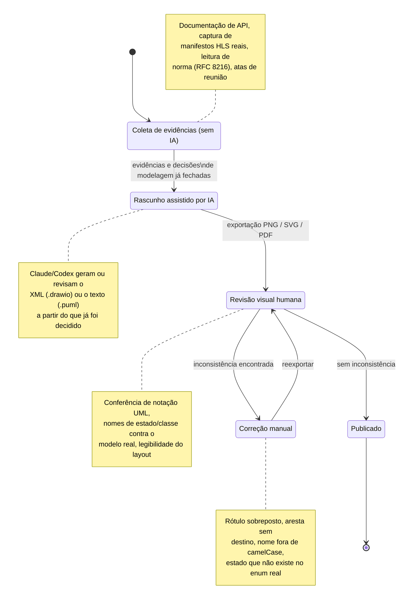

# FOCO_03 — IA Generativa (SubEquipe_01)

**Entrega mínima do foco:** pontos de vista de cada membro sobre as lições aprendidas e o uso de IA Generativa. **Todos os membros devem participar.**

Este foco existe porque a própria decisão **D01** da [Ata S1_01](/Projeto/Atas/Atas_Sg1/ata-S1-01-2026-09-15.md) recomendou o PlantUML como ferramenta principal **por ter integração com IA**, e a decisão **D05** pediu explicitamente que esse uso ficasse registrado com senso crítico — não como nota de rodapé, mas como parte auditável do processo. Por isso, esta página não é uma declaração genérica de "usamos IA no projeto": é um recorte de **onde, especificamente, cada ferramenta foi chamada, o que ela produziu e o que precisou ser corrigido depois**. Pontos que não envolveram IA generativa — como toda a coleta de evidências do FOCO_01/FOCO_02 (leitura de documentação de API, captura de manifestos HLS reais, leitura de norma) e o diagrama de sequência A05 em PlantUML — também aparecem aqui, porque a ausência de IA num ponto crítico do modelo é, em si, uma decisão que vale registrar.

## Participantes no Foco_03

| Nome do Membro | Lições Aprendidas | Uso da IA Generativa (senso crítico) |
| -- | -- | -- |
| Lucas Andrade Zanetti | Gerar um diagrama de componentes e uma máquina de estados **por script** (montando o XML do `.drawio` em Python a partir das decisões e evidências já registradas) obriga a formalizar antes as regras de layout e nomenclatura — e isso expôs inconsistências entre artefatos que passariam despercebidas numa montagem manual: o estado `CONFIGURING` do diagrama de sequência não existe na enumeração `LiveStreamStatus` do modelo estático v2 (que usa `CREATED`); o desfecho `BLOCKED` citado no FOCO_02 também não está na enumeração; e `LiveStreamStatus` encolheu de 7 valores (decisão DE07, v1) para 4 (v2) sem que isso tivesse sido registrado em nenhuma página. Nenhuma dessas três divergências apareceria só de olhar cada diagrama isoladamente. | Usei Claude (via Claude Code) para gerar e ajustar iterativamente o XML dos diagramas de componentes e de estados — não para decidir *o que* modelar (isso veio das decisões DE01–DE10 do FOCO_01 e das evidências E1–E13/F02-E1–E11 já coletadas por mim e pelos colegas), mas para produzir a representação gráfica: geometria dos componentes/estados, roteamento automático de conectores entre camadas, e a montagem das tabelas de evidência por página. Em nenhuma das duas iniciativas o primeiro resultado exportado ficou pronto: cada rodada de exportação em PNG mostrou problema visual concreto — rótulos de transição sobrepostos ao próprio estado, um pseudoestado inicial encostado no título da região, uma seta de sinal cruzando por cima de outro subsistema no consolidado — e cada um desses problemas exigiu ajuste manual (reposicionamento, mudança de `exitX`/`exitY`, deslocamento de rótulo) antes da publicação. O aprendizado central: IA generativa acelera a *geração* e a *correção pontual* de um artefato visual, mas não substitui a inspeção visual humana da legibilidade final. |
| Matheus Lemes Amaral | Entrar como coautor de um artefato que outra pessoa começou — o esqueleto do diagrama de classes (v1, Lucas) e, depois, o subsistema C1 e a máquina M1 gerados por IA a partir do que a subequipe já tinha decidido — deixou claro que aceitar uma coautoria exige revisar o conteúdo linha a linha antes de assinar, e não só concordar com o resultado visual. Na revisão de UGC/clipagem com Pedro (PR #5), corrigir o papel do `ContentRepository` e o estado de `ClipRequestStatus` só foi possível porque os dois conferiram o texto contra o que fora combinado em reunião, não contra a aparência do diagrama. | Não usei IA generativa diretamente para gerar diagramas nesta entrega; minha parte foi de revisão. Primeiro, revisando com Pedro Druck o pacote de UGC/clipagem já modelado por Lucas (sem IA nessa etapa). Depois, como coautor do subsistema C1 (Diagrama de Componentes) e da máquina M1 (Diagrama de Máquina de Estados), que foram gerados com apoio de Claude Code por Lucas: o ponto crítico do meu papel ali foi conferir se os nomes de estado (`NOT_ELIGIBLE`, `ELIGIBLE`, `SUSPENDED`, `ACTIVE`/`EXPIRED`/`REVOKED`) e as guardas batiam com o `CreatorProfile` e o `IngestCredentials` do modelo estático real, e não aceitar a geração automática só porque o desenho parecia coerente. |
| Pedro Druck Montalvão Reis | Modelar o fluxo de Clipagem deixou explícito que operações aparentemente simples (recortar e transcodificar um trecho de vídeo) não podem ser tratadas como síncronas no diagrama — precisam de um disparo assíncrono e de um mecanismo de consulta de status; sem isso, o modelo ficaria irrealista. | IA generativa (Claude, via Claude Code) foi usada como ferramenta de apoio para montar e iterar o XML do diagrama de sequência em draw.io (lifelines, barras de ativação, fragmentos `alt`/`loop`, legenda) — ver detalhes na linha 2 do registro abaixo. O fluxo modelado, os nomes das operações e as decisões de escopo foram definidos e revisados pela dupla; a ferramenta não teve acesso a nenhuma evidência real de uma plataforma de clipagem, então o resultado é assumido como um modelo ilustrativo, não uma engenharia reversa. |
| Heitor Macedo Ricardo | Modelar o A05 (Transmissão ao vivo) direto em PlantUML, por texto, tornou a revisão por *diff* muito mais simples do que comparar duas imagens de um `.drawio` — mas exigiu atenção redobrada com a sintaxe: um fragmento `alt` mal fechado ou uma seta de retorno sem a lifeline correta só aparecem como erro na hora de renderizar, não durante a escrita. | Usei o Codex para revisar o arquivo Draw.io v3 (integração dos componentes Reprodução/Playback e Usuários/Canais) antes de abrir o PR #8 — ele identificou uma referência a `NetworkMetrics` sem definição, nomes fora de camelCase, problemas de visibilidade/multiplicidade e uma aresta sem destino, tudo corrigido manualmente antes da publicação (ver linha 1 do registro abaixo). Já o diagrama de sequência A05, em PlantUML, **não** teve apoio de IA: segui a recomendação da decisão D01 de modelar por texto, mas o "texto" ali fui eu mesmo escrevendo a sintaxe a partir das evidências E4, E6, E7, E8 e E11 já coletadas no FOCO_02 — nenhuma ferramenta gerou o conteúdo do diagrama, só a minha leitura da documentação da plataforma. |

## Como a IA generativa foi usada — visão geral

O diagrama abaixo resume o **padrão de uso** que se repetiu nas três ferramentas com apoio de IA (Codex na revisão do diagrama de classes v3; Claude nos diagramas de sequência de Clipagem e nas duas iniciativas extras). Ele não descreve uma ferramenta específica, mas o ciclo comum a todas: a IA nunca substituiu a coleta de evidência nem a decisão de modelagem — entrou depois, na geração/revisão da representação gráfica, e sempre seguida de inspeção visual humana.

**O que fica de fora deste ciclo, por decisão explícita:** o diagrama de sequência A05 (Heitor, PlantUML manual) e toda a coleta de evidências dos FOCO_01/FOCO_02 — a IA nunca leu a documentação da plataforma nem decidiu que `RecordingAvailable` deveria ser um evento; isso foi trabalho humano registrado nas páginas de evidências de cada foco.

## Registro de uso de IA Generativa

*Rastro de onde a IA foi efetivamente usada no processo da subequipe, para que o ponto de vista de cada membro seja verificável.*

| # | Ferramenta / modelo | Onde foi usada | O que foi aproveitado | O que precisou ser corrigido |
| -- | -- | -- | -- | -- |
| 1 | Codex | Revisão do arquivo Draw.io v3, documentação dos componentes e preparação do PR | Identificação de inconsistências UML, estruturação das páginas de evidência e verificações de integração | Referência a `NetworkMetrics` sem definição, nomes fora de camelCase, visibilidades, multiplicidades, uma aresta sem destino e notas desatualizadas foram revisadas antes da publicação |
| 2 | Claude (Anthropic), via Claude Code | Geração e ajuste iterativo do diagrama de sequência (draw.io) do tema Clipagem — [FOCO_02](/Base/Relatórios/1.1.1.SubEquipe_01/1.1.1.2.Foco02.ModelagemDinamica.md#modelo-dinâmico-clipagem) | Montagem das lifelines, barras de ativação, fragmento `alt` (buffer do trecho disponível/indisponível), fragmento `loop` (consulta de status do clipe) e legenda da notação | O rascunho inicial usava texto branco sem um fundo compatível definido no XML, o que o deixaria ilegível fora do modo escuro do editor; a cor de fundo/texto foi corrigida e o XML final foi aberto e validado visualmente no draw.io antes da publicação |
| 3 | Claude (Anthropic), via Claude Code | Geração do `.drawio` das duas iniciativas extras — [Diagrama de Componentes](/Base/Relatórios/1.1.1.SubEquipe_01/1.1.1.9.Extra.DiagramaComponentes.md) (4 subsistemas + consolidado) e [Diagrama de Máquina de Estados](/Base/Relatórios/1.1.1.SubEquipe_01/1.1.1.10.Extra.DiagramaEstados.md) (4 máquinas + consolidado) — a partir de um script Python que monta o XML programaticamente | Montagem inicial das 10 páginas (layout em camadas, roteamento ortogonal automático de conectores entre interfaces/estados, geração das tabelas de evidência e da matriz de integração de cada página) | A cada exportação em PNG apareceu ao menos um problema visual — rótulo de transição sobreposto ao estado, pseudoestado inicial colado no título da região, uma rota de sinal cruzando por cima de outro subsistema no consolidado — corrigidos manualmente (ajuste de `exitX`/`exitY`, deslocamento de coordenada, redistribuição de trilha de roteamento) e reexportados até a leitura ficar limpa. A decomposição em subsistemas/estados e o vínculo de cada transição a uma evidência foram definidos a partir do material já existente da subequipe (FOCO_01/FOCO_02), não gerados pela IA |

## Histórico de Versões

| Versão | Data | Descrição | Autor(es) | Revisor(es) |
| -- | -- | -- | -- | -- |
| 1.0 | 14/09/2026 | Criação da página do FOCO_03 | [@Bappoz](https://github.com/Bappoz) | |
| 1.1 | 17/09/2026 | Registro do uso de IA generativa no diagrama de sequência da Clipagem e do ponto de vista de Pedro Druck Montalvão Reis | [@pedruck](https://github.com/pedruck) | |
| 1.2 | 17/09/2026 | Preenchimento dos pontos de vista de Lucas Andrade Zanetti, Matheus Lemes Amaral e Heitor Macedo Ricardo; introdução detalhando o porquê do foco; diagrama Mermaid do padrão de uso de IA; novo registro de uso de IA (linha 3) nas iniciativas extras | [@Bappoz](https://github.com/Bappoz) | |
