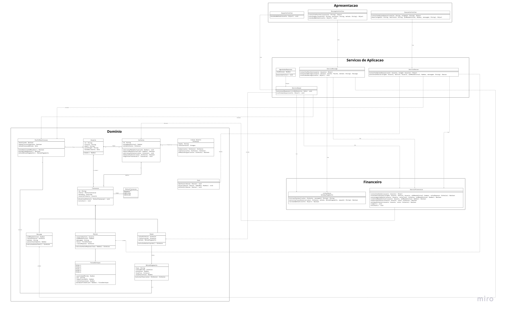
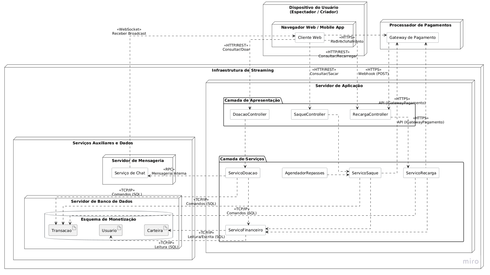

# FOCO_01 · Modelagem Estática — SubEquipe_02

> **Entrega mínima do foco**: modelos estáticos na notação UML — Diagrama de Classes e Diagrama de Implantação.
> **Status**: 🟢 Concluído · **Responsáveis**: Davi Severiano Freitas, Daniel de Oliveira Lira, Mateus Rodrigues Barreto e Pedro Henrique Freire Rodrigues.

## 1. Participantes no Foco

| Membro | Módulo | Papel no foco |
| -- | -- | -- |
| Davi Severiano Freitas | Monetização | Diagrama de Classes e Diagrama de Implantação do módulo de Monetização |
| Mateus Rodrigues Barreto | Monetização | Diagrama de Classes e Diagrama de Implantação do módulo de Monetização |
| Daniel de Oliveira Lira | Chat · Monetização (apoio) | Diagrama de Classes e Diagrama de Implantação do módulo de Chat; refinamento do Diagrama de Implantação de Monetização |
| Pedro Henrique Freire Rodrigues | Chat | Diagrama de Classes e Diagrama de Implantação do módulo de Chat |

## 2. Metodologia do Foco

A modelagem estática foi conduzida em duplas organizadas por módulo funcional, conforme deliberado na [Ata S2_02](/Projeto/Atas/Atas_Sg2/ata-S2-02-2026-09-14.md). Cada dupla ficou responsável pelo domínio completo do seu módulo (estático e dinâmico), garantindo consistência entre os artefatos.

- **Módulo de Monetização** (Davi e Mateus): partiu dos fluxos de recarga, doação e saque identificados na [Engenharia Reversa da Entrega 01](https://unbarqdsw2026-2-turma01.github.io/2026.2-T01-_G6_ProjetoStreamingVideo_Entrega_01/#/Base/Relatorios/1.1.2.SubEquipe_02/3.EngenhariaReversa) e na [Engenharia Reversa complementar](/Base/Relatórios/1.1.2.SubEquipe_02/1.1.2.4.Extra.EngenhariaReversa.md), que documenta a mensagem paga destacada e o repasse ao criador.
- **Módulo de Chat** (Pedro e Daniel): partiu dos fluxos de envio de mensagem e interação no chat documentados na Engenharia Reversa da Entrega 01.

**Modelagem em duas passagens (Monetização).** A dupla produziu uma **versão inicial** do diagrama de classes diretamente a partir dos achados da engenharia reversa e, em seguida, **validou essa versão contra os diagramas de sequência** do [FOCO_02](/Base/Relatórios/1.1.2.SubEquipe_02/1.1.2.2.Foco02.ModelagemDinamica.md), percorrendo cada fluxo mensagem a mensagem. Esse cruzamento revelou lacunas estruturais que não eram visíveis na primeira passagem e originou a versão final publicada em §4.1.1. Os refinamentos incorporados estão listados na tabela da mesma seção. O trabalho ocorreu em sessões conjuntas por Discord, sem divisão por classe ou por seção: ambos atuaram em todas as etapas, da versão inicial à consolidação final.

**Diagrama de implantação (Monetização).** A dupla elaborou a versão inicial da topologia a partir dos participantes já identificados nos diagramas de sequência (cliente web, controllers, serviços de aplicação, serviço financeiro, processadores externos e agendador). Daniel de Oliveira Lira, que havia modelado a implantação do módulo de Chat, apoiou a dupla no refinamento do artefato, padronizando a notação de nós, artefatos e caminhos de comunicação entre os dois módulos. Os três participaram da versão final.

| Evento | Data | Registro |
| -- | -- | -- |
| Reunião S2_02 — divisão por módulo funcional | 14/09/2026 | [Ata S2_02](/Projeto/Atas/Atas_Sg2/ata-S2-02-2026-09-14.md) |
| Reunião S2_03 — validação final dos diagramas de implantação | 16/09/2026 | [Ata S2_03](/Projeto/Atas/Atas_Sg2/ata-S2-03-2026-09-16.md) |

## 3. Fundamentação Teórica

O **Diagrama de Classes** é o artefato central da modelagem estática na UML. Segundo Booch, Rumbaugh e Jacobson (2005 — R02), ele descreve a estrutura do sistema por meio de classes, atributos, operações e os relacionamentos entre objetos — como associações, generalizações, dependências e composições. É o diagrama mais utilizado na orientação a objetos por servir de base tanto para a implementação quanto para a validação de regras de negócio.

O **Diagrama de Implantação** (*Deployment Diagram*) complementa a visão estrutural ao representar a topologia física e lógica do sistema: nós de hardware e ambientes de execução, artefatos de software implantados e os caminhos de comunicação entre eles. É particularmente relevante para sistemas distribuídos como plataformas de streaming, nos quais a separação entre cliente, servidores de aplicação, gateways de pagamento e CDN de mídia deve ser explicitada (OMG, 2017 — R03).

## 4. Artefato

### 4.1. Módulo de Monetização

**Responsáveis**: Davi Severiano Freitas e Mateus Rodrigues Barreto (diagrama de classes e implantação), com apoio de Daniel de Oliveira Lira no refinamento do diagrama de implantação.

#### 4.1.1. Diagrama de Classes — Monetização

O modelo está organizado em quatro pacotes que explicitam a separação de responsabilidades:

| Pacote | Conteúdo | Responsabilidade |
| -- | -- | -- |
| **Apresentação** | `RecargaController`, `DoacaoController`, `SaqueController` | Traduzem a requisição em chamadas ao serviço do caso de uso; não contêm regra de negócio |
| **Serviços de Aplicação** | `ServicoRecarga`, `ServicoDoacao`, `ServicoSaque`, `AgendadorRepasses` | Orquestram as regras de negócio de cada caso de uso |
| **Financeiro** | `ServicoFinanceiro`, `GatewayPagamento` | Movimentação de saldos com controle transacional (`commit` e `rollback`) e integração com processadores externos |
| **Domínio** | `Usuario`, `PerfilMonetizacao`, `Carteira`, `Dinheiro`, `MetodoPagamento`, `Transacao` e especializações, `FaixaDestaque`, `StatusTransacao`, `Chat` | Entidades e objetos de valor; realizam apenas os próprios cálculos, sem acessar repositórios ou APIs |

**Decisões de projeto consolidadas**

| Decisão | Justificativa |
| -- | -- |
| Usuário unificado, sem herança entre espectador e criador | O papel é definido dinamicamente pelas associações (quem transmite e quem assiste), evitando hierarquia rígida |
| `Transacao` abstrata, especializada em `Recarga`, `Doacao` e `Saque` | Cada operação exige atributos exclusivos e comportamento de cálculo distinto |
| Composição entre `Usuario` e `Carteira` | A carteira não existe sem o usuário |
| `Dinheiro` como objeto de valor, com valor em centavos inteiros | Isola as regras aritméticas e a moeda, evitando erros de ponto flutuante em valores monetários |
| Um serviço de aplicação por caso de uso, com serviço financeiro único | Reduz o acoplamento: as regras de domínio ficam isoladas do controle transacional de saldos |
| Inversão de dependência via `GatewayPagamento` | O módulo não depende de nenhum processador de pagamento concreto |
| Métodos de dedução retornando `Boolean` | Verificação de saldo e débito ocorrem na mesma operação, condição necessária para consistência sob concorrência |
| Entidades calculam, mas não persistem (`calcularValorTotal`, `calcularValorRepasse`, `calcularValorLiquido`) | Mantém a regra de cálculo junto do dado, sem acoplar o domínio à infraestrutura |
| Atributos derivados marcados com `/` (`/valorRepasse`, `/valorLiquido`) | Explicita que o valor resulta de cálculo, conforme a notação UML |

**Refinamentos incorporados após a validação contra os diagramas de sequência**

| # | Refinamento aplicado | Origem |
| -- | -- | -- |
| A01 | Fragmentação do serviço monolítico em `ServicoRecarga`, `ServicoDoacao` e `ServicoSaque`, com `ServicoFinanceiro` restrito à movimentação de saldos e ao controle transacional | Arquitetura dos diagramas de sequência ([FOCO_02](/Base/Relatórios/1.1.2.SubEquipe_02/1.1.2.2.Foco02.ModelagemDinamica.md)) |
| A02 | Inclusão da camada de controllers, antes ausente | Lifelines dos diagramas de sequência |
| A03 | Criação de `PerfilMonetizacao`, com verificação de criador monetizado, dados fiscais e carência de alteração do método | Achados SQ02, SQ09 e SQ13 da Eng. Reversa complementar |
| A04 | Criação de `MetodoPagamento`, com limite mínimo, prazo, taxa fixa e taxa percentual | Achados SQ11 e SQ12 |
| A05 | Criação de `FaixaDestaque`, com quantidade mínima, cor, tempo de fixação e limite de caracteres | Achados SC01 e SC02 |
| A06 | Inclusão do atributo `saldoDinheiro` em `Carteira`, antes implícito nos métodos de dinheiro | Fluxos de Doação e Saque |
| A07 | Substituição de `processarPagamento` por `iniciarCheckout`, `solicitarTransferencia` e `validarWebhook`, compatíveis com o modelo de checkout delegado e confirmação assíncrona | Fluxo de Recarga e achados da Entrega 01 |
| A08 | Inclusão da agregação de histórico entre `Carteira` e `Transacao`, do estado `CANCELADA` e da operação `cancelar()` | Fluxos de exceção dos três diagramas de sequência |
| A09 | Remoção de acessadores triviais (`getSaldo*`, `definirMetodoPagamento`, `formatar`, `estaPendente`) e marcação dos atributos derivados | Revisão de aderência à notação UML |
| A10 | Substituição de anotações com nomes proprietários de plataformas por rótulos genéricos | Diretriz de anonimização (Escopo do Produto, FE06) |
| A11 | Inclusão de `AgendadorRepasses`, que dispara o ciclo periódico de repasse | Fluxo de Saque, que não é iniciado pelo criador |

#### 4.1.2. Diagrama de Implantação — Monetização

A topologia distribui o módulo em quatro nós e explicita o protocolo de cada caminho de comunicação:

| Nó | Artefatos | Comunicação |
| -- | -- | -- |
| **Dispositivo do Usuário** | Cliente Web (navegador ou aplicativo móvel) | `HTTP/REST` para os controllers; `WebSocket` para receber o broadcast do chat; `HTTPS` no redirecionamento ao processador de pagamentos |
| **Processador de Pagamentos** (externo) | Gateway de pagamento | Recebe chamadas `HTTPS` pela interface `GatewayPagamento` e devolve a confirmação por `HTTPS` (webhook `POST`) ao `RecargaController` e ao `SaqueController` |
| **Servidor de Aplicação** | Camada de Apresentação (três controllers) e Camada de Serviços (três serviços de aplicação, agendador e serviço financeiro) | `TCP/IP` com comandos SQL ao banco; `RPC` com o servidor de mensageria |
| **Serviços Auxiliares e Dados** | Servidor de Mensageria (serviço de chat) e Servidor de Banco de Dados (esquema de monetização: `Transacao`, `Usuario`, `Carteira`) | Leitura e escrita por `TCP/IP`; o serviço de chat publica o evento da doação aos espectadores conectados |

Dois pontos merecem destaque na topologia. Primeiro, o **retorno do pagamento não passa pelo cliente**: o processador externo entrega a confirmação diretamente ao servidor de aplicação por webhook, o que sustenta a idempotência modelada nos fluxos de Recarga e de Saque. Segundo, a **notificação da doação ao chat é um caminho separado** do fluxo transacional, atravessando o servidor de mensageria até o cliente por WebSocket, o que permite que uma falha na exibição não invalide a transação já concluída.

---

### 4.2. Módulo de Chat

**Responsáveis**: Pedro Henrique Freire Rodrigues e Daniel de Oliveira Lira.

#### 4.2.1. Diagrama de Classes — Chat

#### 4.2.2. Diagrama de Implantação — Chat

## 5. Rastreabilidade & Elos com Outros Artefatos

| Elemento do artefato | Elo com | Onde | Responsáveis | Natureza do elo |
| -- | -- | -- | -- | -- |
| Diagrama de Classes — Monetização | Fluxos de recarga, doação e saque | [Modelagem Dinâmica](/Base/Relatórios/1.1.2.SubEquipe_02/1.1.2.2.Foco02.ModelagemDinamica.md) | Davi Severiano Freitas, Mateus Rodrigues Barreto | As classes participam como lifelines nos diagramas de sequência correspondentes |
| Diagrama de Implantação — Monetização | Mensagens assíncronas dos fluxos de Recarga e Saque | [Modelagem Dinâmica](/Base/Relatórios/1.1.2.SubEquipe_02/1.1.2.2.Foco02.ModelagemDinamica.md) | Davi Severiano Freitas, Mateus Rodrigues Barreto (apoio: Daniel de Oliveira Lira) | O caminho de webhook e o canal de broadcast materializam as mensagens assíncronas modeladas nas sequências |
| Diagrama de Classes — Chat | Fluxo de envio de mensagem | [Modelagem Dinâmica](/Base/Relatórios/1.1.2.SubEquipe_02/1.1.2.2.Foco02.ModelagemDinamica.md) | Pedro Henrique Freire Rodrigues, Daniel de Oliveira Lira | As classes participam como lifelines nos diagramas de sequência do Chat |
| Diagrama de Implantação — Chat | Comunicação WebSocket e infraestrutura Pub/Sub | [Modelagem Dinâmica](/Base/Relatórios/1.1.2.SubEquipe_02/1.1.2.2.Foco02.ModelagemDinamica.md) | Pedro Henrique Freire Rodrigues, Daniel de Oliveira Lira | Representa a topologia física de suporte à mensageria de chat distribuída |
| Regras de negócio inferidas | Engenharia Reversa (Entrega 01) | [Eng. Reversa Entrega 01](https://unbarqdsw2026-2-turma01.github.io/2026.2-T01-_G6_ProjetoStreamingVideo_Entrega_01/#/Base/Relatorios/1.1.2.SubEquipe_02/3.EngenhariaReversa) | Davi Severiano Freitas, Mateus Rodrigues Barreto, Pedro Henrique Freire Rodrigues, Daniel de Oliveira Lira | Os achados e regras inferidas fundamentam os atributos e operações das classes |
| `FaixaDestaque` | Engenharia Reversa complementar | [Extra — Eng. Reversa](/Base/Relatórios/1.1.2.SubEquipe_02/1.1.2.4.Extra.EngenhariaReversa.md) | Mateus Rodrigues Barreto | Os achados SC01–SC06 fundamentam cor, tempo de fixação e limite de caracteres (refinamento A05) |
| `PerfilMonetizacao` e `MetodoPagamento` | Engenharia Reversa complementar | [Extra — Eng. Reversa](/Base/Relatórios/1.1.2.SubEquipe_02/1.1.2.4.Extra.EngenhariaReversa.md) | Davi Severiano Freitas | Os achados SQ02, SQ09, SQ11 e SQ12 fundamentam os refinamentos A03 e A04 |
| `AgendadorRepasses` | Engenharia Reversa complementar | [Extra — Eng. Reversa](/Base/Relatórios/1.1.2.SubEquipe_02/1.1.2.4.Extra.EngenhariaReversa.md) | Davi Severiano Freitas | Os achados SQ10 e SQ11 sustentam o repasse periódico automático em vez de retirada sob demanda |

## 6. Senso Crítico

**O que o artefato entrega bem.** O artefato oferece uma visão estrutural consolidada do sistema, mapeando as entidades fundamentais, seus atributos, operações e inter-relações lógicas. No módulo de Chat, destacam-se a separação arquitetural em camadas (front-end e back-end) e o uso consistente de estereótipos UML (`<<boundary>>`, `<<control>>`, `<<service>>`, `<<subsystem>>` e `<<entity>>`), que encapsulam responsabilidades e desacoplam serviços críticos como o gateway de API, o motor de moderação e o barramento de eventos. No módulo de Monetização, o modelo final expressa uma separação em quatro pacotes com responsabilidades distintas, isolando as regras de negócio do controle transacional de saldos e mantendo o domínio independente de infraestrutura. As decisões de projeto originais — usuário unificado, hierarquia de transações, objeto de valor para dinheiro e inversão de dependência no gateway — foram preservadas integralmente, o que indica que a base conceitual estava correta desde a primeira passagem. A visão topológica dos dois diagramas de implantação ilustra a distribuição física da solução e, no caso da monetização, explicita que a confirmação do pagamento chega por webhook ao servidor, e não pelo cliente.

**Limitações reconhecidas.** A principal limitação intrínseca aos diagramas estáticos é a incapacidade de representar o comportamento temporal: a ordem das chamadas, a assincronicidade típica de fluxos de mensageria e de confirmação por webhook, os estados mutáveis e as regras em execução ao longo do tempo não são capturados pelo artefato — o que torna a modelagem dinâmica ([FOCO_02](/Base/Relatórios/1.1.2.SubEquipe_02/1.1.2.2.Foco02.ModelagemDinamica.md)) uma dependência central para a compreensão sistêmica. Persistem ainda três desvios menores de notação no diagrama de classes de Monetização, identificados na revisão final e mantidos por decisão de estabilidade do artefato: a enumeração `StatusTransacao` aparece ligada a `Transacao` por associação, quando bastaria ser o tipo do atributo; a composição entre `Carteira` e `Dinheiro` sugere contenção exclusiva de um objeto de valor que é usado como tipo em várias classes; e alguns atributos (`usuarioPrimario`, `faixa`, `metodo`) duplicam informação já expressa pelas associações correspondentes, quando o adequado seria representá-los como nomes de papel. Registra-se também, como evolução futura, a possibilidade de reificar o lançamento em carteira (uma classe intermediária entre `Carteira` e `Transacao`), o que tornaria explícito o duplo registro da doação — débito na origem e crédito no destino — e permitiria armazenar o valor movimentado em cada carteira por operação.

**O que a subequipe faria diferente.** Conforme discutido e validado na [Reunião S2_03](/Projeto/Atas/Atas_Sg2/ata-S2-03-2026-09-16.md), a subequipe adotaria uma estratégia que priorizasse a elaboração da modelagem dinâmica antes da estática. Ficou evidente que compreender a troca temporal de mensagens, os fluxos de exceção e a assincronicidade da comunicação funciona como insumo indispensável para lapidar o modelo estático. A comparação entre a versão inicial do diagrama de classes de Monetização e a versão final é a evidência mais direta disso: a fragmentação do serviço monolítico, a camada de controllers e conceitos como perfil de monetização, método de pagamento, faixa de destaque e agendador de repasses só se tornaram visíveis ao percorrer os fluxos mensagem a mensagem. Os onze refinamentos registrados em §4.1.1 são, na prática, o retrabalho que essa ordem invertida gerou — e que teria sido evitado caso a modelagem dinâmica viesse primeiro.

## 7. Participantes & Comprobatórios

| Membro | Contribuição | Comprobatório (commit/PR) |
| -- | -- | -- |
| Davi Severiano Freitas | Divisão do artefato em Chat/Monetização; senso crítico; elaboração conjunta do diagrama de classes de Monetização (versão inicial e versão final validada contra os diagramas de sequência) e do diagrama de implantação do módulo; tabelas de decisões, refinamentos e rastreabilidade | [Ata S2_02](/Projeto/Atas/Atas_Sg2/ata-S2-02-2026-09-14.md) · [Ata S2_03](/Projeto/Atas/Atas_Sg2/ata-S2-03-2026-09-16.md) · [`43c0d2c`](https://github.com/UnBArqDsw2026-2-Turma01/2026.2-T01-_G6_ProjetoStreamingVideo_Entrega_02/commit/43c0d2cbff90a04f82238a16860ad3c4babed664) · [`b454a32`](https://github.com/UnBArqDsw2026-2-Turma01/2026.2-T01-_G6_ProjetoStreamingVideo_Entrega_02/commit/b454a32e3dc73c773d49b63ed0f0a36a6a03fce4) · [`1332f9e`](https://github.com/UnBArqDsw2026-2-Turma01/2026.2-T01-_G6_ProjetoStreamingVideo_Entrega_02/commit/1332f9ebddf1b81a6f78d0ff4288c52bc17fb8df) · [`469ce52`](https://github.com/UnBArqDsw2026-2-Turma01/2026.2-T01-_G6_ProjetoStreamingVideo_Entrega_02/commit/469ce526dc6914b49356307a68eeda65bf1b52a5) · [`909a648`](https://github.com/UnBArqDsw2026-2-Turma01/2026.2-T01-_G6_ProjetoStreamingVideo_Entrega_02/commit/909a648b663584a5d7b87e4520ad7709f34c7a57) |
| Mateus Rodrigues Barreto | Estrutura inicial da modelagem estática; elaboração conjunta do diagrama de classes de Monetização (versão inicial e versão final) e do diagrama de implantação do módulo, em sessões conjuntas com Davi Freitas | [Ata S2_02](/Projeto/Atas/Atas_Sg2/ata-S2-02-2026-09-14.md) · [`fb23b62`](https://github.com/UnBArqDsw2026-2-Turma01/2026.2-T01-_G6_ProjetoStreamingVideo_Entrega_02/commit/fb23b6260239d5c40726aafc298f466e7a3c7783) |
| Daniel de Oliveira Lira | Co-responsável pelo módulo de Chat (diagrama de classes e de implantação); apoio à dupla de Monetização no refinamento do diagrama de implantação e na padronização da notação de nós e caminhos de comunicação entre os módulos; reorganização de assets e inclusão de imagens | [Ata S2_02](/Projeto/Atas/Atas_Sg2/ata-S2-02-2026-09-14.md) · [Ata S2_03](/Projeto/Atas/Atas_Sg2/ata-S2-03-2026-09-16.md) · [`7c72da5`](https://github.com/UnBArqDsw2026-2-Turma01/2026.2-T01-_G6_ProjetoStreamingVideo_Entrega_02/commit/7c72da543850e38c01d3ac56323f0e76984a0547) |
| Pedro Henrique Freire Rodrigues | Co-responsável pelo módulo de Chat (diagrama de classes e de implantação) | [Ata S2_02](/Projeto/Atas/Atas_Sg2/ata-S2-02-2026-09-14.md) · [Ata S2_03](/Projeto/Atas/Atas_Sg2/ata-S2-03-2026-09-16.md) · §1 |

## 8. Referências

A bibliografia completa e unificada da SubEquipe_02 está catalogada no documento central de [1.1.2.5. Referências — SubEquipe_02](/Base/Relatórios/1.1.2.SubEquipe_02/1.1.2.5.Referencias.md).

| # | Referência | Onde foi usada |
| -- | -- | -- |
| R01 | PRESSMAN, Roger S.; MAXIM, Bruce R. **Engenharia de Software: uma abordagem profissional**. 8. ed. Porto Alegre: AMGH, 2016. | (Rastreabilidade) |
| R02 | BOOCH, Grady; RUMBAUGH, James; JACOBSON, Ivar. **UML: guia do usuário**. 2. ed. Rio de Janeiro: Elsevier, 2005. | (Fundamentação Teórica) |
| R03 | OBJECT MANAGEMENT GROUP. **Unified Modeling Language (UML) Specification**, versão 2.5.1, 2017. | (Fundamentação Teórica) |

---

## Histórico de Versões

| Versão | Data | Descrição | Autor(es) | Revisor(es) |
| -- | -- | -- | -- | -- |
| 1.0 | 16/09/2026 | Criação do documento | Davi Severiano Freitas | |
| 1.1 | 16/09/2026 | Estruturação da documentação: participantes, metodologia, fundamentação teórica e rastreabilidade | Mateus Rodrigues Barreto | |
| 1.2 | 17/09/2026 | Adição do Senso Crítico (análise estrita em camadas, estereótipos UML, limitações temporais e aprendizados da modelagem dinâmica) | Davi Severiano Freitas | |
| 1.3 | 17/09/2026 | Adição das imagens referentes ao módulo de monetização | Daniel de Oliveira Lira | Mateus Rodrigues Barreto |
| 1.4 | 17/09/2026 | Inserção do diagrama de classes de Monetização em versão preliminar, com decisões consolidadas e refinamentos previstos; registro da pendência do diagrama de implantação; seção de referências; revisão do senso crítico e da rastreabilidade | Davi Severiano Freitas | |
| 1.5 | 18/09/2026 | Padronização de links internos para rotas absolutas do Docsify e correção de referências cruzadas | Davi Severiano Freitas | Daniel de Oliveira Lira, Mateus Rodrigues Barreto, Pedro Henrique Freire Rodrigues |
| 1.6 | 18/09/2026 | Atualização de Participantes & Comprobatórios com commits da Entrega 2 | Pedro Henrique Freire Rodrigues | |
| 1.7 | 18/09/2026 | Alinhamento dos identificadores de referências (R01 a R03) com o catálogo central 1.1.2.5 | Davi Severiano Freitas | Daniel de Oliveira Lira, Mateus Rodrigues Barreto, Pedro Henrique Freire Rodrigues |
| 1.8 | 18/09/2026 | Publicação da versão final do diagrama de classes de Monetização e do diagrama de implantação do módulo; descrição dos pacotes e da topologia; registro dos refinamentos incorporados (A01–A11) e da autoria conjunta; revisão do senso crítico e da rastreabilidade | Davi Severiano Freitas | Daniel de Oliveira Lira, Mateus Rodrigues Barreto |
