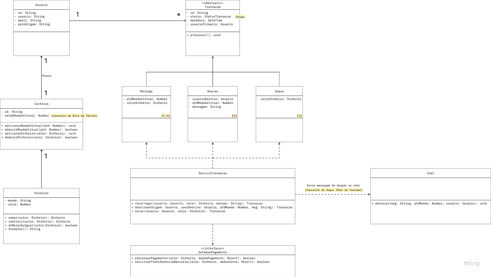
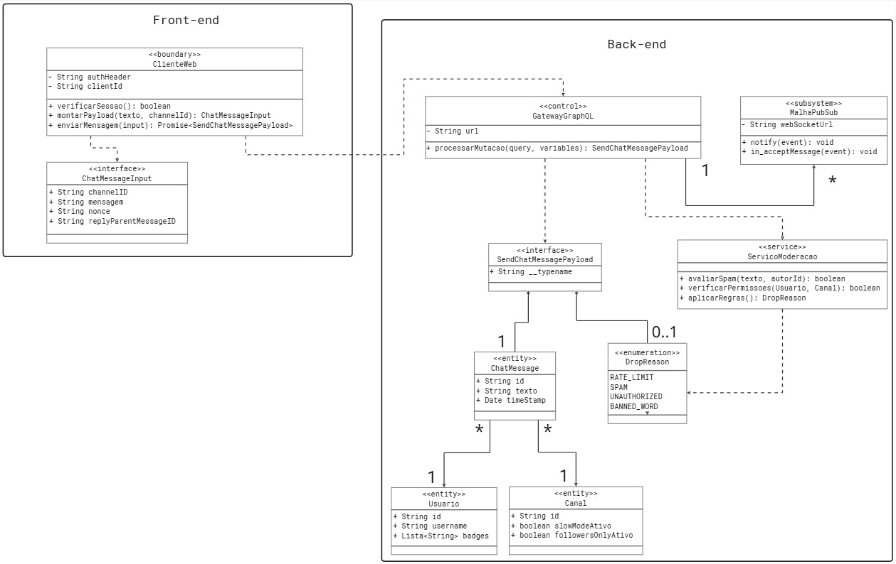
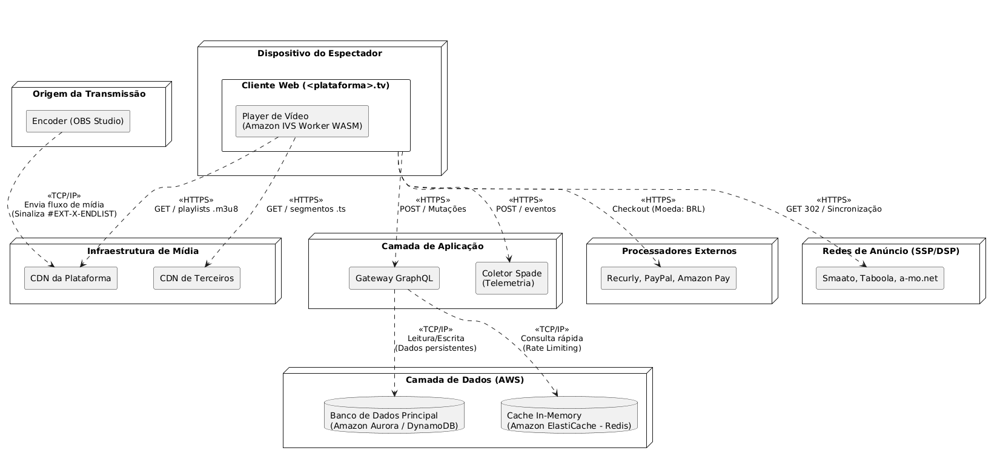

# FOCO_01 · Modelagem Estática — SubEquipe_02

> **Entrega mínima do foco**: modelos estáticos na notação UML — Diagrama de Classes e Diagrama de Implantação.
> **Status**: 🟡 Em andamento · **Responsáveis**: Davi Severiano Freitas, Daniel de Oliveira Lira, Mateus Rodrigues Barreto e Pedro Henrique Freire Rodrigues.
> ⚠️ **Pendências conhecidas nesta versão**: o diagrama de classes do módulo de Monetização está em versão preliminar (ver §4.1.1) e o diagrama de implantação do mesmo módulo ainda não foi elaborado (ver §4.1.2). Ambos serão concluídos antes do encerramento da entrega.

## 1. Participantes no Foco

| Membro | Módulo | Papel no foco |
| -- | -- | -- |
| Davi Severiano Freitas | Monetização | Diagrama de Classes e Diagrama de Implantação do módulo de Monetização |
| Mateus Rodrigues Barreto | Monetização | Diagrama de Classes e Diagrama de Implantação do módulo de Monetização |
| Pedro Henrique Freire Rodrigues | Chat | Diagrama de Classes e Diagrama de Implantação do módulo de Chat |
| Daniel de Oliveira Lira | Chat | Diagrama de Classes e Diagrama de Implantação do módulo de Chat |

## 2. Metodologia do Foco

A modelagem estática foi conduzida em duplas organizadas por módulo funcional, conforme deliberado na [Ata S2_02](../../../Projeto/Atas/Atas_Sg2/ata-S2-02-2026-09-14.md). Cada dupla ficou responsável pelo domínio completo do seu módulo (estático e dinâmico), garantindo consistência entre os artefatos.

- **Módulo de Monetização** (Davi e Mateus): partiu dos fluxos de recarga, doação e saque identificados na [Engenharia Reversa da Entrega 01](https://unbarqdsw2026-2-turma01.github.io/2026.2-T01-_G6_ProjetoStreamingVideo_Entrega_01/#/Base/Relatorios/1.1.2.SubEquipe_02/3.EngenhariaReversa) e na [Engenharia Reversa complementar](/Base/Relatórios/1.1.2.SubEquipe_02/1.1.2.4.Extra.EngenhariaReversa.md), que documenta a mensagem paga destacada e o repasse ao criador.
- **Módulo de Chat** (Pedro e Daniel): partiu dos fluxos de envio de mensagem e interação no chat documentados na Engenharia Reversa da Entrega 01.

A modelagem do módulo de Monetização foi construída antes da modelagem dinâmica correspondente. Durante a elaboração dos diagramas de sequência (FOCO_02), surgiram refinamentos estruturais que ainda não estão refletidos no diagrama de classes publicado nesta versão. As divergências identificadas estão registradas de forma explícita em §4.1.1, e o aprendizado metodológico decorrente está discutido no Senso Crítico (§6).

| Evento | Data | Registro |
| -- | -- | -- |
| Reunião S2_02 — divisão por módulo funcional | 14/09/2026 | [Ata S2_02](/Projeto/Atas/Atas_Sg2/ata-S2-02-2026-09-14.md) |
| Reunião S2_03 — validação final dos diagramas de implantação | 16/09/2026 | [Ata S2_03](/Projeto/Atas/Atas_Sg2/ata-S2-03-2026-09-16.md) |

## 3. Fundamentação Teórica

O **Diagrama de Classes** é o artefato central da modelagem estática na UML. Segundo Booch, Rumbaugh e Jacobson (2005 — R06), ele descreve a estrutura do sistema por meio de classes, atributos, operações e os relacionamentos entre objetos — como associações, generalizações, dependências e composições. É o diagrama mais utilizado na orientação a objetos por servir de base tanto para a implementação quanto para a validação de regras de negócio.

O **Diagrama de Implantação** (*Deployment Diagram*) complementa a visão estrutural ao representar a topologia física e lógica do sistema: nós de hardware e ambientes de execução, artefatos de software implantados e os caminhos de comunicação entre eles. É particularmente relevante para sistemas distribuídos como plataformas de streaming, nos quais a separação entre cliente, servidores de aplicação, gateways de pagamento e CDN de mídia deve ser explicitada (OMG, 2017 — R07).

## 4. Artefato

### 4.1. Módulo de Monetização

**Responsáveis**: Davi Severiano Freitas e Mateus Rodrigues Barreto.

#### 4.1.1. Diagrama de Classes — Monetização

🟡 **Versão preliminar (v1)**. Este diagrama foi elaborado antes dos diagramas de sequência e representa o estado da modelagem no momento da gravação da apresentação. A versão revisada está em elaboração conjunta pela dupla e incorporará os refinamentos listados abaixo.

**Decisões de projeto já consolidadas nesta versão**

| Decisão | Justificativa |
| -- | -- |
| Usuário unificado, sem herança entre espectador e criador | O papel é definido dinamicamente pelas associações (quem transmite e quem assiste), evitando hierarquia rígida |
| Transacao abstrata, especializada em Recarga, Doacao e Saque | Cada operação exige atributos exclusivos (mensagem no chat, valor em dinheiro) e comportamento de processamento distinto |
| Composição entre Usuario e Carteira | A carteira não existe sem o usuário |
| Dinheiro como objeto de valor, com operações próprias | Isola as regras aritméticas e a moeda do restante do domínio |
| Inversão de dependência via GatewayPagamento | O módulo não depende de nenhum processador de pagamento concreto |
| Métodos de dedução retornando boolean | Verificação de saldo e débito ocorrem na mesma operação, condição necessária para consistência sob concorrência |

**Refinamentos previstos para a versão revisada**

| # | Ajuste previsto | Origem |
| -- | -- | -- |
| A01 | Fragmentar ServicoTransacao em um serviço por caso de uso (ServicoRecarga, ServicoDoacao, ServicoSaque), mantendo um ServicoFinanceiro restrito à movimentação de saldos e ao controle transacional | Arquitetura adotada nos diagramas de sequência (FOCO_02) |
| A02 | Incluir a camada de controllers (RecargaController, DoacaoController, SaqueController), hoje ausente | Lifelines dos diagramas de sequência |
| A03 | Criar PerfilMonetizacao, com verificação de criador monetizado, dados fiscais e carência de alteração | Achados SQ02, SQ09 e SQ13 da Eng. Reversa complementar |
| A04 | Criar MetodoPagamento, com limite mínimo, prazo e taxa próprios | Achados SQ11 e SQ12 |
| A05 | Criar FaixaDestaque, com cor, tempo de fixação e limite de caracteres | Achados SC01 e SC02 |
| A06 | Adicionar o atributo saldoDinheiro em Carteira, hoje implícito nos métodos de dinheiro | Fluxos de Doação e Saque |
| A07 | Substituir processarPagamento por operações compatíveis com o modelo de checkout delegado (iniciarCheckout e validarWebhook) | Fluxo de Recarga e achados da Entrega 01 |
| A08 | Adicionar a agregação de histórico entre Carteira e Transacao, além do estado CANCELADA e da operação de cancelamento | Fluxos de exceção dos três diagramas de sequência |
| A09 | Remover acessadores triviais e a associação com a enumeração StatusTransacao, declarando-a apenas como tipo do atributo | Revisão de aderência à notação UML |
| A10 | Substituir as anotações que citam nomes proprietários de plataformas por rótulos genéricos | Diretriz de anonimização (Escopo do Produto, FE06) |

#### 4.1.2. Diagrama de Implantação — Monetização

🔴 **Não elaborado nesta versão**. A dupla priorizou a conclusão dos três diagramas de sequência do módulo (ver FOCO_02), dos quais dependem os nós e artefatos a serem representados. O diagrama será elaborado a partir da topologia já evidenciada nos fluxos: cliente web, serviços de aplicação, serviço financeiro, processadores de pagamento externos e agendador de repasses.

---

### 4.2. Módulo de Chat

**Responsáveis**: Pedro Henrique Freire Rodrigues e Daniel de Oliveira Lira.

#### 4.2.1. Diagrama de Classes — Chat

#### 4.2.2. Diagrama de Implantação — Chat

## 5. Rastreabilidade & Elos com Outros Artefatos

| Elemento do artefato | Elo com | Onde | Natureza do elo |
| -- | -- | -- | -- |
| Classes do módulo de Monetização | Fluxos de recarga, doação e saque | [Modelagem Dinâmica](/Base/Relatórios/1.1.2.SubEquipe_02/1.1.2.2.Foco02.ModelagemDinamica.md) | As classes participam como lifelines nos diagramas de sequência correspondentes |
| Classes do módulo de Chat | Fluxo de envio de mensagem | [Modelagem Dinâmica](/Base/Relatórios/1.1.2.SubEquipe_02/1.1.2.2.Foco02.ModelagemDinamica.md) | As classes participam como lifelines nos diagramas de sequência do Chat |
| Regras de negócio inferidas | Engenharia Reversa (Entrega 01) | [Eng. Reversa Entrega 01](https://unbarqdsw2026-2-turma01.github.io/2026.2-T01-_G6_ProjetoStreamingVideo_Entrega_01/#/Base/Relatorios/1.1.2.SubEquipe_02/3.EngenhariaReversa) | Os achados e regras inferidas fundamentam os atributos e operações das classes |
| Faixas de destaque da mensagem paga | Engenharia Reversa complementar | [Extra — Eng. Reversa](/Base/Relatórios/1.1.2.SubEquipe_02/1.1.2.4.Extra.EngenhariaReversa.md) | Os achados SC01–SC06 fundamentam as regras de destaque a serem modeladas (refinamento A05) |
| Perfil de monetização e método de pagamento | Engenharia Reversa complementar | [Extra — Eng. Reversa](/Base/Relatórios/1.1.2.SubEquipe_02/1.1.2.4.Extra.EngenhariaReversa.md) | Os achados SQ02, SQ09, SQ11 e SQ12 fundamentam os refinamentos A03 e A04 |

## 6. Senso Crítico

**O que o artefato entrega bem.** O artefato oferece uma visão estrutural consolidada do sistema, mapeando as entidades fundamentais, seus atributos, operações e inter-relações lógicas. No módulo de Chat, destacam-se a separação arquitetural em camadas (front-end e back-end) e o uso consistente de estereótipos UML (`<<boundary>>`, `<<control>>`, `<<service>>`, `<<subsystem>>` e `<<entity>>`), que encapsulam responsabilidades e desacoplam serviços críticos como o gateway de API, o motor de moderação e o barramento de eventos. No módulo de Monetização, as decisões de projeto documentadas em §4.1.1 — usuário unificado, hierarquia de transações, objeto de valor para dinheiro e inversão de dependência no gateway de pagamento — mostram-se sólidas e foram preservadas integralmente pela modelagem dinâmica posterior. A visão topológica do diagrama de implantação do Chat ilustra a distribuição física da solução, separando os nós de infraestrutura e de software.

**Limitações reconhecidas.** A principal limitação intrínseca aos diagramas estáticos é a incapacidade de representar o comportamento temporal: a ordem das chamadas, a assincronicidade típica de fluxos de mensageria e de confirmação por webhook, os estados mutáveis e as regras em execução ao longo do tempo não são capturados pelo artefato. Além disso, esta versão apresenta duas limitações próprias e assumidas: o diagrama de classes de Monetização está em estado preliminar, com dez refinamentos já identificados e registrados em §4.1.1, e o diagrama de implantação do mesmo módulo não foi elaborado. Nenhuma das duas decorre de indefinição de escopo — ambas resultam da priorização, pela dupla, da modelagem dinâmica como insumo para a estática.

**O que a subequipe faria diferente.** Conforme discutido e validado na [Reunião S2_03](../../../Projeto/Atas/Atas_Sg2/ata-S2-03-2026-09-16.md), a subequipe adotaria uma estratégia que priorizasse a elaboração da modelagem dinâmica antes da estática. Ficou evidente que compreender a troca temporal de mensagens, os fluxos de exceção e a assincronicidade da comunicação funciona como insumo indispensável para lapidar o modelo estático. A comparação entre o diagrama de classes preliminar e os diagramas de sequência do módulo de Monetização é a evidência mais direta disso: a fragmentação do serviço monolítico, a necessidade de uma camada de controllers e a existência de conceitos como perfil de monetização, método de pagamento e faixa de destaque só se tornaram visíveis ao percorrer os fluxos mensagem a mensagem. Essa ordem garante que as classes possuam, de fato, os atributos e métodos demandados pela operação, evitando retrabalho.

## 7. Participantes & Comprobatórios

| Membro | Contribuição | Comprobatório (commit/PR) |
| -- | -- | -- |
| Davi Severiano Freitas | Divisão do artefato em Chat/Monetização; senso crítico; diagrama de classes de Monetização (versão preliminar), tabelas de decisões e correções de imagens | [Ata S2_02](../../../Projeto/Atas/Atas_Sg2/ata-S2-02-2026-09-14.md) · [Ata S2_03](../../../Projeto/Atas/Atas_Sg2/ata-S2-03-2026-09-16.md) · [`43c0d2c`](https://github.com/UnBArqDsw2026-2-Turma01/2026.2-T01-_G6_ProjetoStreamingVideo_Entrega_02/commit/43c0d2cbff90a04f82238a16860ad3c4babed664) · [`b454a32`](https://github.com/UnBArqDsw2026-2-Turma01/2026.2-T01-_G6_ProjetoStreamingVideo_Entrega_02/commit/b454a32e3dc73c773d49b63ed0f0a36a6a03fce4) · [`1332f9e`](https://github.com/UnBArqDsw2026-2-Turma01/2026.2-T01-_G6_ProjetoStreamingVideo_Entrega_02/commit/1332f9ebddf1b81a6f78d0ff4288c52bc17fb8df) · [`469ce52`](https://github.com/UnBArqDsw2026-2-Turma01/2026.2-T01-_G6_ProjetoStreamingVideo_Entrega_02/commit/469ce526dc6914b49356307a68eeda65bf1b52a5) · [`909a648`](https://github.com/UnBArqDsw2026-2-Turma01/2026.2-T01-_G6_ProjetoStreamingVideo_Entrega_02/commit/909a648b663584a5d7b87e4520ad7709f34c7a57) |
| Mateus Rodrigues Barreto | Estrutura inicial da modelagem estática; co-responsável pelo módulo de Monetização (classes e implantação) | [Ata S2_02](../../../Projeto/Atas/Atas_Sg2/ata-S2-02-2026-09-14.md) · [`fb23b62`](https://github.com/UnBArqDsw2026-2-Turma01/2026.2-T01-_G6_ProjetoStreamingVideo_Entrega_02/commit/fb23b6260239d5c40726aafc298f466e7a3c7783) |
| Pedro Henrique Freire Rodrigues | Co-responsável pelo módulo de Chat (diagrama de classes e de implantação) | [Ata S2_02](../../../Projeto/Atas/Atas_Sg2/ata-S2-02-2026-09-14.md) · [Ata S2_03](../../../Projeto/Atas/Atas_Sg2/ata-S2-03-2026-09-16.md) · §1 |
| Daniel de Oliveira Lira | Co-responsável pelo módulo de Chat; reorganização de assets e inclusão de imagens dos diagramas estáticos | [Ata S2_02](../../../Projeto/Atas/Atas_Sg2/ata-S2-02-2026-09-14.md) · [`7c72da5`](https://github.com/UnBArqDsw2026-2-Turma01/2026.2-T01-_G6_ProjetoStreamingVideo_Entrega_02/commit/7c72da543850e38c01d3ac56323f0e76984a0547) |

## 8. Referências

| # | Referência | Onde foi usada |
| -- | -- | -- |
| R06 | BOOCH, Grady; RUMBAUGH, James; JACOBSON, Ivar. **UML: guia do usuário**. 2. ed. Rio de Janeiro: Elsevier, 2005. | (Fundamentação Teórica) |
| R07 | OBJECT MANAGEMENT GROUP. **Unified Modeling Language (UML) Specification**, versão 2.5.1, 2017. | (Fundamentação Teórica) |
| R01 | PRESSMAN, Roger S.; MAXIM, Bruce R. **Engenharia de Software: uma abordagem profissional**. 8. ed. Porto Alegre: AMGH, 2016. | (Rastreabilidade) |

---

## Histórico de Versões

| Versão | Data | Descrição | Autor(es) | Revisor(es) |
| -- | -- | -- | -- | -- |
| 1.0 | 16/09/2026 | Criação do documento | Davi Severiano Freitas | |
| 1.1 | 16/09/2026 | Estruturação da documentação: participantes, metodologia, fundamentação teórica e rastreabilidade | Mateus Rodrigues Barreto | |
| 1.2 | 17/09/2026 | Adição do Senso Crítico (análise estrita em camadas, estereótipos UML, limitações temporais e aprendizados da modelagem dinâmica) | Davi Severiano Freitas | |
| 1.3 | 17/09/2026 | Adição das imagens referentes ao módulo de monetização | Daniel de Oliveira Lira | Mateus Rodrigues Barreto |
| 1.4 | 17/09/2026 | Inserção do diagrama de classes de Monetização em versão preliminar, com decisões consolidadas e refinamentos previstos; registro da pendência do diagrama de implantação; seção de referências; revisão do senso crítico e da rastreabilidade | Davi Severiano Freitas | |
| 1.5 | 18/09/2026 | Padronização de links internos para rotas absolutas do Docsify e correção de referências cruzadas | Davi Severiano Freitas | Daniel de Oliveira Lira, Mateus Rodrigues Barreto, Pedro Henrique Freire Rodrigues |
| 1.6 | 18/09/2026 | Atualização de Participantes & Comprobatórios com commits da Entrega 2 | Pedro Henrique Freire Rodrigues | |
