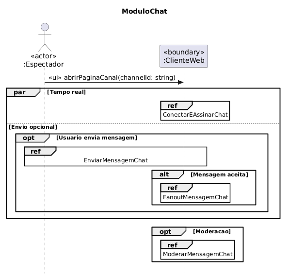
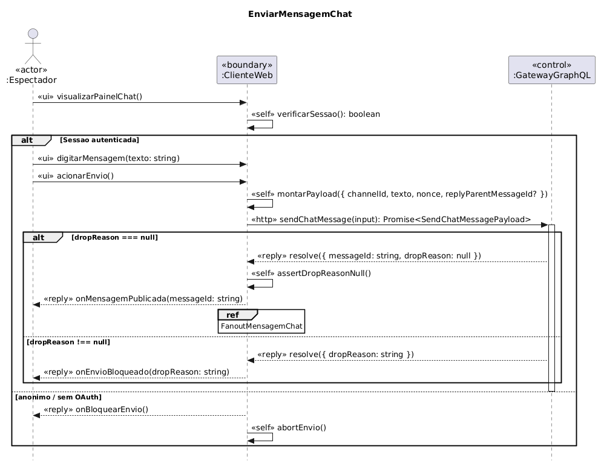

# FOCO_02 · Modelagem Dinâmica — SubEquipe_02

> **Entrega mínima do foco**: modelos dinâmicos na notação UML — Diagrama de Sequência.
> **Status**: 🟡 Em andamento · **Responsáveis**: Davi Severiano Freitas, Daniel de Oliveira Lira, Mateus Rodrigues Barreto e Pedro Henrique Freire Rodrigues.

## 1. Participantes no Foco

| Membro | Módulo | Diagrama(s) de Sequência |
| -- | -- | -- |
| Davi Severiano Freitas | Monetização | Recarga (com Mateus) · Saque |
| Mateus Rodrigues Barreto | Monetização | Recarga (com Davi) · Doação |
| Pedro Henrique Freire Rodrigues | Chat | ModuloChat, ConectarEAssinarChat, EnviarMensagemChat |
| Daniel de Oliveira Lira | Chat | FanoutMensagemChat, ModerarMensagemChat |

## 2. Metodologia do Foco

A modelagem dinâmica seguiu a mesma organização por módulo funcional adotada no [FOCO_01 — Modelagem Estática](1.1.2.1.Foco01.ModelagemEstatica.md), conforme deliberado na [Ata S2_02](../../../Projeto/Atas/Atas_Sg2/ata-S2-02-2026-09-14.md). Cada dupla construiu os diagramas de sequência do seu módulo a partir dos fluxos levantados na Engenharia Reversa.

**Módulo de Monetização** (Davi e Mateus) — três diagramas de sequência:

| Diagrama | Fluxo modelado | Responsável(is) |
| -- | -- | -- |
| Recarga | Fluxo de aquisição de moedas virtuais pelo espectador | Davi Severiano Freitas e Mateus Rodrigues Barreto |
| Doação | Fluxo de envio de doação (moedas virtuais) ao criador durante a transmissão | Mateus Rodrigues Barreto |
| Saque | Fluxo de retirada de saldo pelo criador de conteúdo | Davi Severiano Freitas |

**Módulo de Chat** (Pedro e Daniel) — cinco diagramas de sequência:

| Diagrama | Fluxo modelado | Responsável(is) |
| -- | -- | -- |
| ModuloChat | Visão geral da orquestração dos sub-fluxos (Conexão, Envio e Moderação) | Pedro Henrique Freire Rodrigues |
| ConectarEAssinarChat | Estabelecimento da conexão contínua (WebSocket / Malha PubSub) e assinatura de tópicos | Pedro Henrique Freire Rodrigues |
| EnviarMensagemChat | Validação da sessão autenticada, envio via mutação GraphQL e tratamento de recusa/sucesso | Pedro Henrique Freire Rodrigues |
| FanoutMensagemChat | Distribuição (broadcasting) do evento de chat da Malha PubSub para todos os assinantes conectados | Daniel de Oliveira Lira |
| ModerarMensagemChat | Pipeline de análise de risco (AutoMod), retenção em quarentena e aprovação/bloqueio por um moderador humano | Daniel de Oliveira Lira |

| Evento | Data | Registro |
| -- | -- | -- |
| Reunião S2_02 — divisão por módulo funcional | 14/09/2026 | [Ata S2_02](../../../Projeto/Atas/Atas_Sg2/ata-S2-02-2026-09-14.md) |

## 3. Fundamentação Teórica

O **Diagrama de Sequência** é um dos diagramas de interação da UML e modela o comportamento dinâmico de um sistema ao representar a troca de mensagens entre objetos (lifelines) ao longo do tempo. Segundo Booch, Rumbaugh e Jacobson (2005), ele é especialmente adequado para descrever cenários de uso específicos, evidenciando a ordem temporal das mensagens, os fragmentos combinados (alternativas, loops, opcionais) e os retornos de cada chamada.

Em sistemas de streaming com interatividade massiva e monetização, o diagrama de sequência permite explicitar:
- A **comunicação assíncrona** entre o cliente, o gateway de API e os processadores de pagamento externos (ex: fluxo de recarga).
- A **arquitetura de mensageria e comunicação em tempo real** (ex: conexões WebSocket contínuas, mecanismos de fanout e pub/sub) essenciais para manter o chat operante sob pico de acessos.
- Os **pontos de decisão e de segurança** (ex: validação de saldo mínimo para saque, filtro algorítmico do AutoMod, quarentena de mensagens suspeitas e orquestração de bloqueios).
- A **distribuição de responsabilidades** entre front-end, serviços de domínio e integrações externas.

## 4. Artefato

### 4.1. Módulo de Monetização

#### 4.1.1. Diagrama de Sequência — Recarga

**Responsáveis**: Davi Severiano Freitas e Mateus Rodrigues Barreto.

<!-- Inserir o diagrama de sequência do fluxo de Recarga aqui -->
*(Pendente: Inserção do link da imagem)*

---

#### 4.1.2. Diagrama de Sequência — Doação

**Responsável**: Mateus Rodrigues Barreto.

<!-- Inserir o diagrama de sequência do fluxo de Doação aqui -->
*(Pendente: Inserção do link da imagem)*

---

#### 4.1.3. Diagrama de Sequência — Saque

**Responsável**: Davi Severiano Freitas.

<!-- Inserir o diagrama de sequência do fluxo de Saque aqui -->
*(Pendente: Inserção do link da imagem)*

---

### 4.2. Módulo de Chat

#### 4.2.1. Diagrama de Sequência — ModuloChat
**Responsável**: Pedro Henrique Freire Rodrigues.

#### 4.2.2. Diagrama de Sequência — ConectarEAssinarChat
**Responsável**: Pedro Henrique Freire Rodrigues.

#### 4.2.3. Diagrama de Sequência — EnviarMensagemChat
**Responsável**: Pedro Henrique Freire Rodrigues.

#### 4.2.4. Diagrama de Sequência — FanoutMensagemChat
**Responsável**: Daniel de Oliveira Lira.

#### 4.2.5. Diagrama de Sequência — ModerarMensagemChat
**Responsável**: Daniel de Oliveira Lira.

## 5. Rastreabilidade & Elos com Outros Artefatos

| Elemento do artefato | Elo com | Onde | Natureza do elo |
| -- | -- | -- | -- |
| Lifelines dos diagramas de Monetização | Classes do módulo de Monetização | [Modelagem Estática](1.1.2.1.Foco01.ModelagemEstatica.md) | Cada lifeline corresponde a uma classe ou componente do diagrama de classes |
| Lifelines dos diagramas de Chat | Classes do módulo de Chat | [Modelagem Estática](1.1.2.1.Foco01.ModelagemEstatica.md) | Cada lifeline corresponde a uma classe ou componente (ex: `GatewayGraphQL`, `MalhaPubSub`) |
| Fluxo de Recarga | Checkout de compra de Bits (Entrega 01) | [Eng. Reversa Entrega 01](https://unbarqdsw2026-2-turma01.github.io/2026.2-T01-_G6_ProjetoStreamingVideo_Entrega_01/#/Base/Relatorios/1.1.2.SubEquipe_02/3.EngenhariaReversa) | O fluxo aprofunda em UML o processo de aquisição de moedas reverso-engenheirado na Entrega 01 |
| Fluxo de Doação | Super Chat (plataforma-B) | [FOCO_04 — Eng. Reversa](1.1.2.4.Foco04.EngenhariaReversa.md) | Os achados SC01–SC06 fundamentam as interações modeladas no diagrama de doação |
| Fluxo EnviarMensagemChat | Mutação `sendChatMessage` | [Eng. Reversa Entrega 01](https://unbarqdsw2026-2-turma01.github.io/2026.2-T01-_G6_ProjetoStreamingVideo_Entrega_01/#/Base/Relatorios/1.1.2.SubEquipe_02/3.EngenhariaReversa) | Documenta dinamicamente as atividades A02 e A03 (envio com payload e validação de `dropReason`) |
| Fluxos ConectarEAssinarChat e Fanout | Arquitetura de Pub/Sub | [Artefato Generalista Entrega 01](https://unbarqdsw2026-2-turma01.github.io/2026.2-T01-_G6_ProjetoStreamingVideo_Entrega_01/#/Base/Relatorios/1.1.2.SubEquipe_02/1.ArtefatoGeneralista) | Detalha as setas de atualização em tempo real modeladas conceitualmente na Rich Picture |
| Fluxo ModerarMensagemChat | Resiliência e Load Shedding | [NFR Framework Entrega 01](https://unbarqdsw2026-2-turma01.github.io/2026.2-T01-_G6_ProjetoStreamingVideo_Entrega_01/#/Base/Relatorios/1.1.2.SubEquipe_02/2.NFRFramework) | Explicita o funcionamento dinâmico da moderação e isolamento de usuários (O04, O05) |

## 6. Senso Crítico

Dentre os pontos fortes do artefato, a modelagem dinâmica alcançou um grau de maturidade excelente ao desmembrar fluxos de alta complexidade em diagramas granulares. O Módulo de Chat, por exemplo, demonstrou perfeitamente a assincronicidade inerente às plataformas de streaming ao separar o envio da mensagem (uma requisição HTTP POST/GraphQL clássica) do recebimento de mensagens e fanout (via conexões WebSockets bidirecionais mantidas por rotinas de *keepalive*). O detalhamento de fragmentos combinados (`alt`, `opt`, `par`, `loop`) traduz fielmente o comportamento dinâmico de aplicações reativas de larga escala, evidenciando o tratamento correto de fluxos de exceção (como o envio bloqueado ou a ação do AutoMod).

Dentre as principais limitações reconhecidas, a fragmentação excessiva dos fluxos de chat pode dificultar a visualização do processo fim a fim (espectador A enviando para espectador B) para partes interessadas não técnicas, exigindo a navegação entre múltiplos diagramas. Além disso, devido à natureza de "caixa-preta" da engenharia reversa que originou os dados, o tempo exato de processamento (`durationSec`) das filas internas dos microsserviços (ex: comunicação entre servidor TMI e AutoMod) não pode ser garantido temporalmente, limitando o diagrama de sequência a uma representação da ordem lógica, e não cronológica restrita.

Acerca do que a subequipe faria diferente, adotaríamos uma ferramenta de modelagem com suporte nativo a simulação de execução de diagramas de sequência para validar as chamadas cíclicas e os timeouts. Também padronizaríamos desde o início a estética dos componentes e os prefixos dos estereótipos UML entre os quatro membros da subequipe (como as marcações `<<ui>>`, `<<ws>>`, `<<irc>>`) para evitar fricções na etapa de consolidação final do artefato.

---

## Histórico de Versões

| Versão | Data | Descrição | Autor(es) | Revisor(es) |
| -- | -- | -- | -- | -- |
| 1.0 | 16/09/2026 | Criação do documento | Davi Severiano Freitas | |
| 1.1 | 16/09/2026 | Estruturação da documentação: participantes, metodologia, fundamentação teórica, seções por diagrama e rastreabilidade | Mateus Rodrigues Barreto | |
| 1.2 | 16/09/2026 | Inclusão da tabela metodológica do módulo de chat, atualização de participantes, complemento da fundamentação, inserção dos links dos diagramas, rastreabilidade e senso crítico | Pedro Henrique Freire Rodrigues, Daniel de Oliveira Lira | |