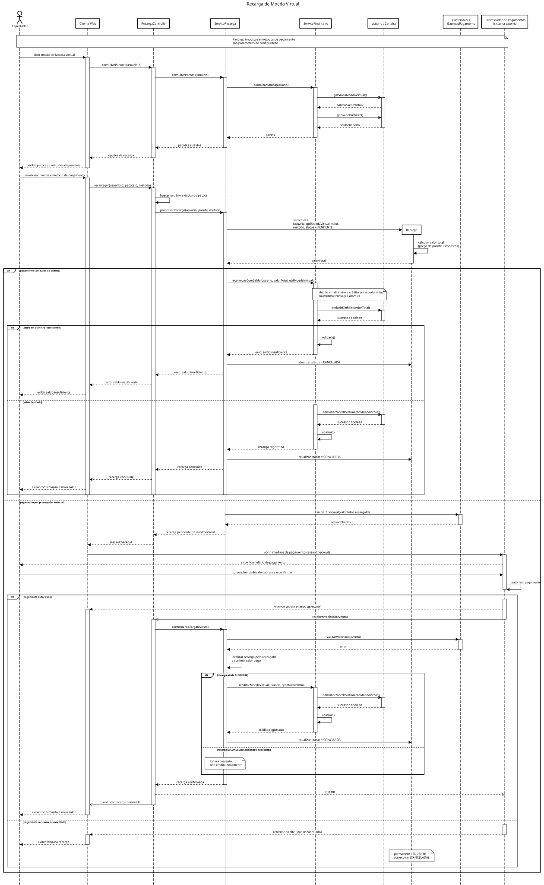
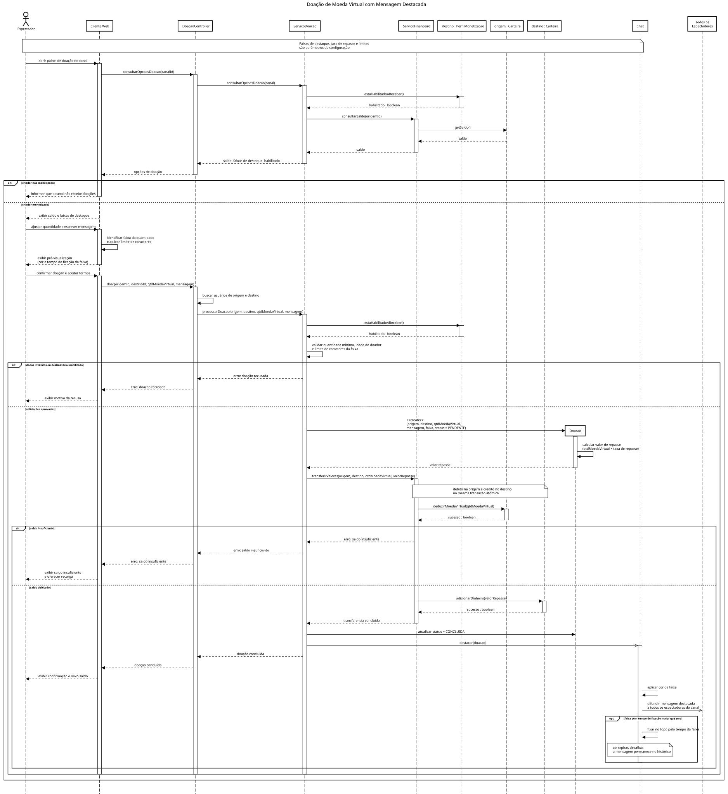
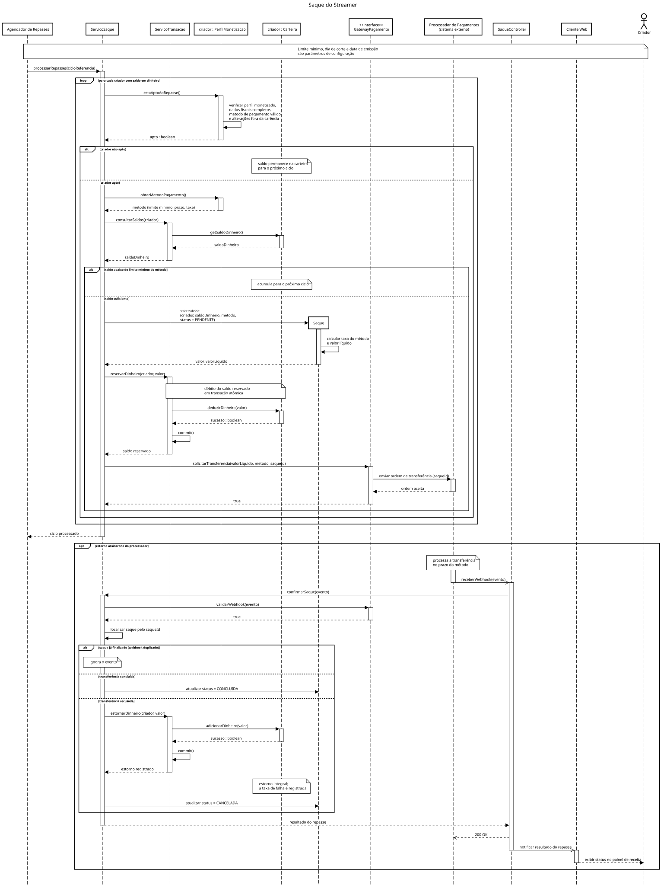
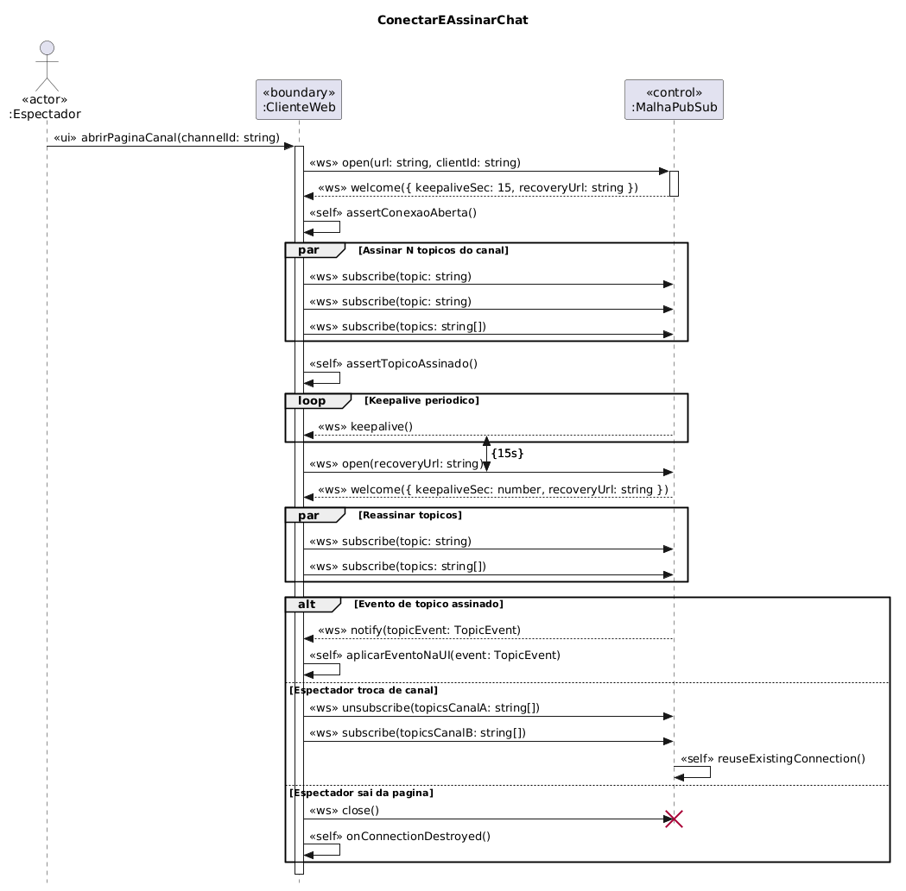
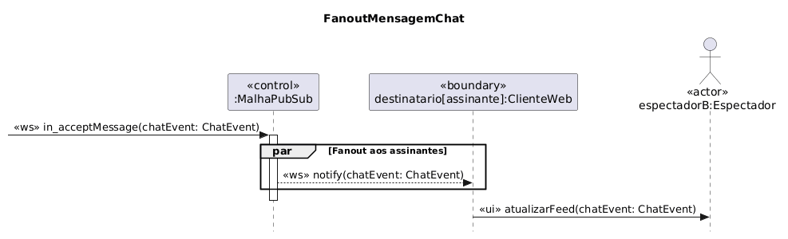
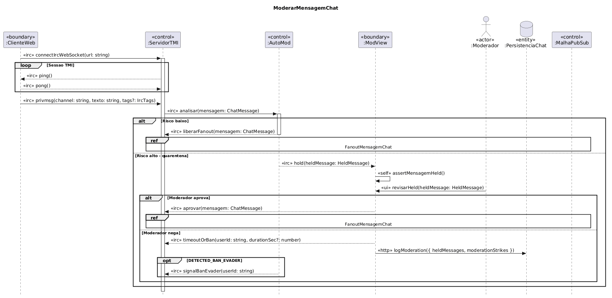

# FOCO_02 · Modelagem Dinâmica — SubEquipe_02

> **Entrega mínima do foco**: modelos dinâmicos na notação UML — Diagrama de Sequência.
> **Status**: 🟢 Concluído · **Responsáveis**: Davi Severiano Freitas, Daniel de Oliveira Lira, Mateus Rodrigues Barreto e Pedro Henrique Freire Rodrigues.

## 1. Participantes no Foco

| Membro | Módulo | Diagrama(s) de Sequência |
| -- | -- | -- |
| Davi Severiano Freitas | Monetização | Recarga (com Mateus) · Saque |
| Mateus Rodrigues Barreto | Monetização | Recarga (com Davi) · Doação |
| Pedro Henrique Freire Rodrigues | Chat | ModuloChat, ConectarEAssinarChat, EnviarMensagemChat |
| Daniel de Oliveira Lira | Chat | FanoutMensagemChat, ModerarMensagemChat |

## 2. Metodologia do Foco

A modelagem dinâmica seguiu a mesma organização por módulo funcional adotada no [FOCO_01 — Modelagem Estática](/Base/Relatórios/1.1.2.SubEquipe_02/1.1.2.1.Foco01.ModelagemEstatica.md), conforme deliberado na [Ata S2_02](/Projeto/Atas/Atas_Sg2/ata-S2-02-2026-09-14.md). Cada dupla construiu os diagramas de sequência do seu módulo a partir dos fluxos levantados na Engenharia Reversa.

**Módulo de Monetização** (Davi e Mateus) — três diagramas de sequência:

| Diagrama | Fluxo modelado | Responsável(is) |
| -- | -- | -- |
| Recarga | Fluxo de aquisição de moeda virtual pelo espectador | Davi Severiano Freitas e Mateus Rodrigues Barreto |
| Doação | Fluxo de envio de doação em moeda virtual ao criador, com mensagem destacada no chat | Mateus Rodrigues Barreto |
| Saque | Fluxo de repasse do saldo acumulado ao criador de conteúdo | Davi Severiano Freitas |

Os três diagramas de monetização compartilham a mesma decisão arquitetural: um serviço de aplicação por caso de uso (`ServicoRecarga`, `ServicoDoacao`, `ServicoSaque`), responsável pelas regras de negócio, e um serviço financeiro único (`ServicoFinanceiro`), restrito à movimentação de saldos e ao controle transacional (commit e rollback). As entidades (`Recarga`, `Doacao`, `Saque`) são instanciadas com `<<create>>` e realizam apenas os próprios cálculos, sem acessar repositórios ou serviços externos.

**Módulo de Chat** (Pedro e Daniel) — cinco diagramas de sequência:

| Diagrama | Fluxo modelado | Responsável(is) |
| -- | -- | -- |
| ModuloChat | Visão geral da orquestração dos sub-fluxos (Conexão, Envio e Moderação) | Pedro Henrique Freire Rodrigues |
| ConectarEAssinarChat | Estabelecimento da conexão contínua (WebSocket / Malha PubSub) e assinatura de tópicos | Pedro Henrique Freire Rodrigues |
| EnviarMensagemChat | Validação da sessão autenticada, envio via mutação GraphQL e tratamento de recusa/sucesso | Pedro Henrique Freire Rodrigues |
| FanoutMensagemChat | Distribuição (broadcasting) do evento de chat da Malha PubSub para todos os assinantes conectados | Daniel de Oliveira Lira |
| ModerarMensagemChat | Pipeline de análise de risco, retenção em quarentena e aprovação/bloqueio por um moderador humano | Daniel de Oliveira Lira |

| Evento | Data | Registro |
| -- | -- | -- |
| Reunião S2_02 — divisão por módulo funcional | 14/09/2026 | [Ata S2_02](/Projeto/Atas/Atas_Sg2/ata-S2-02-2026-09-14.md) |

## 3. Fundamentação Teórica

O **Diagrama de Sequência** é um dos diagramas de interação da UML e modela o comportamento dinâmico de um sistema ao representar a troca de mensagens entre objetos (lifelines) ao longo do tempo. Segundo Booch, Rumbaugh e Jacobson (2005 — R06), ele é especialmente adequado para descrever cenários de uso específicos, evidenciando a ordem temporal das mensagens, os fragmentos combinados (alternativas, loops, opcionais) e os retornos de cada chamada.

Em sistemas de streaming com interatividade massiva e monetização, o diagrama de sequência permite explicitar:
- A comunicação assíncrona entre o cliente, o gateway de API e os processadores de pagamento externos, incluindo o retorno por webhook nos fluxos de recarga e de repasse.
- A arquitetura de mensageria e comunicação em tempo real (conexões WebSocket contínuas, mecanismos de fanout e pub/sub), essencial para manter o chat operante sob pico de acessos.
- Os pontos de decisão e de segurança: verificação de elegibilidade e de limite mínimo antes do repasse, filtro algorítmico de moderação, quarentena de mensagens suspeitas e orquestração de bloqueios.
- As garantias transacionais, com débito e crédito atômicos, tratamento de idempotência em webhooks reenviados e estorno em caso de falha na transferência.
- A distribuição de responsabilidades entre front-end, serviços de domínio e integrações externas.

## 4. Artefato

### 4.1. Módulo de Monetização

#### 4.1.1. Diagrama de Sequência — Recarga

**Responsáveis**: Davi Severiano Freitas e Mateus Rodrigues Barreto.

O fluxo cobre a consulta de pacotes e saldos, a criação da transação em estado pendente e dois caminhos de pagamento: com o saldo em dinheiro do próprio criador, resolvido de forma síncrona e sem processador externo, ou por processador externo, com confirmação assíncrona via webhook. O tratamento de webhook duplicado impede crédito em dobro.

#### 4.1.2. Diagrama de Sequência — Doação

**Responsável**: Mateus Rodrigues Barreto.

O fluxo verifica se o canal está habilitado a receber doações, classifica a quantidade doada em uma faixa de destaque (que define cor, tempo de fixação e limite de caracteres), debita a moeda virtual da origem e credita o valor de repasse ao destino na mesma transação atômica. A notificação ao chat é assíncrona: uma falha na exibição não invalida a doação já concluída.

#### 4.1.3. Diagrama de Sequência — Saque

**Responsável**: Davi Severiano Freitas.

O repasse não é solicitado pelo criador: é disparado por um agendador em ciclo periódico, conforme observado na engenharia reversa. Para cada criador com saldo, o fluxo verifica elegibilidade, dados fiscais, validade do método de pagamento e limite mínimo; quando alguma condição falha, o saldo permanece na carteira para o ciclo seguinte. O valor é reservado antes da ordem de transferência e estornado integralmente se o processador recusar.

### 4.2. Módulo de Chat

#### 4.2.1. Diagrama de Sequência — ModuloChat
**Responsável**: Pedro Henrique Freire Rodrigues.

#### 4.2.2. Diagrama de Sequência — ConectarEAssinarChat
**Responsável**: Pedro Henrique Freire Rodrigues.

#### 4.2.3. Diagrama de Sequência — EnviarMensagemChat
**Responsável**: Pedro Henrique Freire Rodrigues.

#### 4.2.4. Diagrama de Sequência — FanoutMensagemChat
**Responsável**: Daniel de Oliveira Lira.

#### 4.2.5. Diagrama de Sequência — ModerarMensagemChat
**Responsável**: Daniel de Oliveira Lira.

## 5. Rastreabilidade & Elos com Outros Artefatos

| Elemento do artefato | Elo com | Onde | Natureza do elo |
| -- | -- | -- | -- |
| Lifelines dos diagramas de Monetização | Classes do módulo de Monetização | [Modelagem Estática](/Base/Relatórios/1.1.2.SubEquipe_02/1.1.2.1.Foco01.ModelagemEstatica.md) | Cada lifeline corresponde a uma classe ou componente do diagrama de classes |
| Lifelines dos diagramas de Chat | Classes do módulo de Chat | [Modelagem Estática](/Base/Relatórios/1.1.2.SubEquipe_02/1.1.2.1.Foco01.ModelagemEstatica.md) | Cada lifeline corresponde a uma classe ou componente (ex.: `GatewayGraphQL`, `MalhaPubSub`) |
| Fluxo de Recarga | Checkout de compra de moeda virtual (Entrega 01) | [Eng. Reversa Entrega 01](https://unbarqdsw2026-2-turma01.github.io/2026.2-T01-_G6_ProjetoStreamingVideo_Entrega_01/#/Base/Relatorios/1.1.2.SubEquipe_02/3.EngenhariaReversa) | O fluxo aprofunda em UML o processo de aquisição de moeda virtual reverso-engenheirado na Entrega 01 |
| Pagamento de recarga com saldo do criador | Achado SQ08 | [Extra — Eng. Reversa](/Base/Relatórios/1.1.2.SubEquipe_02/1.1.2.4.Extra.EngenhariaReversa.md) | O caminho alternativo do `alt` decorre da possibilidade de usar o saldo em compras internas |
| Fluxo de Doação | Mensagem paga destacada (`<plataforma-B>`) | [Extra — Eng. Reversa](/Base/Relatórios/1.1.2.SubEquipe_02/1.1.2.4.Extra.EngenhariaReversa.md) | Os achados SC01–SC06 fundamentam as faixas de destaque e a ausência de estorno em caso de remoção |
| Verificação de perfil habilitado a receber | Achados SQ02 e SQ09 | [Extra — Eng. Reversa](/Base/Relatórios/1.1.2.SubEquipe_02/1.1.2.4.Extra.EngenhariaReversa.md) | Justifica a distinção entre criador monetizado e não monetizado |
| Fluxo de Saque | Achados SQ10–SQ16 | [Extra — Eng. Reversa](/Base/Relatórios/1.1.2.SubEquipe_02/1.1.2.4.Extra.EngenhariaReversa.md) | Ciclo periódico, limite mínimo por método, retenção por dados incompletos e taxas do método |
| Fluxo EnviarMensagemChat | Mutação `sendChatMessage` | [Eng. Reversa Entrega 01](https://unbarqdsw2026-2-turma01.github.io/2026.2-T01-_G6_ProjetoStreamingVideo_Entrega_01/#/Base/Relatorios/1.1.2.SubEquipe_02/3.EngenhariaReversa) | Documenta dinamicamente as atividades A02 e A03 (envio com payload e validação de `dropReason`) |
| Fluxos ConectarEAssinarChat e Fanout | Arquitetura de Pub/Sub | [Artefato Generalista Entrega 01](https://unbarqdsw2026-2-turma01.github.io/2026.2-T01-_G6_ProjetoStreamingVideo_Entrega_01/#/Base/Relatorios/1.1.2.SubEquipe_02/1.ArtefatoGeneralista) | Detalha as setas de atualização em tempo real modeladas conceitualmente na Rich Picture |
| Fluxo ModerarMensagemChat | Resiliência e Load Shedding | [NFR Framework Entrega 01](https://unbarqdsw2026-2-turma01.github.io/2026.2-T01-_G6_ProjetoStreamingVideo_Entrega_01/#/Base/Relatorios/1.1.2.SubEquipe_02/2.NFRFramework) | Explicita o funcionamento dinâmico da moderação e o isolamento de usuários (O04, O05) |

## 6. Senso Crítico

Entre os pontos fortes, a modelagem dinâmica desmembrou fluxos de alta complexidade em diagramas granulares e rastreáveis. O Módulo de Chat evidenciou a assincronicidade inerente às plataformas de streaming ao separar o envio da mensagem — uma requisição HTTP/GraphQL clássica — do recebimento e do fanout, que ocorrem por conexões WebSocket bidirecionais mantidas por rotinas de *keepalive*. O Módulo de Monetização, por sua vez, explicitou garantias transacionais que raramente aparecem em modelagens introdutórias: débito e crédito atômicos, idempotência no tratamento de webhooks reenviados e estorno em caso de recusa da transferência. O uso de fragmentos combinados (`alt`, `opt`, `par`, `loop`) traduz o comportamento de aplicações reativas e cobre os fluxos de exceção.

Entre as limitações reconhecidas, a fragmentação dos fluxos de chat pode dificultar a visualização do processo fim a fim — do espectador que envia ao que recebe — para partes interessadas não técnicas, exigindo navegação entre múltiplos diagramas. Nos fluxos de monetização, o retorno por webhook e o momento exato do ciclo de repasse não foram observados na engenharia reversa: são inferências apoiadas em documentação oficial e no contrato de monetização, o que limita o diagrama à ordem lógica das mensagens, e não a uma cronologia garantida. O mesmo vale para o tempo de processamento das filas internas dos serviços de chat.

Há ainda duas inconsistências conhecidas entre os diagramas. A primeira é de nomenclatura: o diagrama de Saque rotula o serviço financeiro como `ServicoTransacao`, enquanto Recarga e Doação usam `ServicoFinanceiro`; o nome correto é o segundo, já que a classe não conhece as entidades `Transacao`. A segunda é o próprio título do diagrama de Saque, que remete a uma retirada sob demanda, embora o fluxo modelado seja um repasse periódico automático. Ambas serão corrigidas na consolidação final.

Sobre o que a subequipe faria diferente, adotaríamos desde o início uma única ferramenta de modelagem, com suporte a simulação de execução, para validar chamadas cíclicas e timeouts. Também padronizaríamos os estereótipos UML entre os quatro membros (por exemplo `<<ui>>`, `<<ws>>`, `<<boundary>>` e `<<control>>`), evitando a fricção observada na consolidação.

## 7. Participantes & Comprobatórios

| Membro | Contribuição | Comprobatório (commit/PR) |
| -- | -- | -- |
| Davi Severiano Freitas | Finalização do FOCO_02 com os três diagramas de sequência de Monetização (Recarga, Doação e Saque/repasse); consolidação documental | [Ata S2_02](../../../Projeto/Atas/Atas_Sg2/ata-S2-02-2026-09-14.md) · [Ata S2_03](../../../Projeto/Atas/Atas_Sg2/ata-S2-03-2026-09-16.md) · [`b9a2f9b`](https://github.com/UnBArqDsw2026-2-Turma01/2026.2-T01-_G6_ProjetoStreamingVideo_Entrega_02/commit/b9a2f9b14d7a03ce36f8d6d1b55642cb0d758a12) |
| Mateus Rodrigues Barreto | Co-responsável por Recarga; responsável por Doação; estruturação inicial do relatório | [Ata S2_02](../../../Projeto/Atas/Atas_Sg2/ata-S2-02-2026-09-14.md) · [`fb23b62`](https://github.com/UnBArqDsw2026-2-Turma01/2026.2-T01-_G6_ProjetoStreamingVideo_Entrega_02/commit/fb23b6260239d5c40726aafc298f466e7a3c7783) · §1 |
| Pedro Henrique Freire Rodrigues | Diagramas de sequência do Chat (`ModuloChat`, `ConectarEAssinarChat`, `EnviarMensagemChat`); complementos de metodologia, rastreabilidade e senso crítico | [Ata S2_02](../../../Projeto/Atas/Atas_Sg2/ata-S2-02-2026-09-14.md) · [Ata S2_03](../../../Projeto/Atas/Atas_Sg2/ata-S2-03-2026-09-16.md) · Histórico v1.2 · §1 |
| Daniel de Oliveira Lira | Diagramas de sequência do Chat (`FanoutMensagemChat`, `ModerarMensagemChat`); inclusão dos artefatos no relatório e correção de caminhos de assets | [Ata S2_02](../../../Projeto/Atas/Atas_Sg2/ata-S2-02-2026-09-14.md) · [`969f60a`](https://github.com/UnBArqDsw2026-2-Turma01/2026.2-T01-_G6_ProjetoStreamingVideo_Entrega_02/commit/969f60a758bacacc018791f2245c8860b721c1e6) · [`703ebaf`](https://github.com/UnBArqDsw2026-2-Turma01/2026.2-T01-_G6_ProjetoStreamingVideo_Entrega_02/commit/703ebafb655014bd4e7ae519ebea9aed4bdfc0a2) · [`7c72da5`](https://github.com/UnBArqDsw2026-2-Turma01/2026.2-T01-_G6_ProjetoStreamingVideo_Entrega_02/commit/7c72da543850e38c01d3ac56323f0e76984a0547) |

## 8. Referências

- **R06**: BOOCH, Grady; RUMBAUGH, James; JACOBSON, Ivar. **UML: guia do usuário**. 2. ed. Rio de Janeiro: Elsevier, 2005.
- **R01**: PRESSMAN, Roger S.; MAXIM, Bruce R. **Engenharia de Software: uma abordagem profissional**. 8. ed. Porto Alegre: AMGH, 2016.

---

## Histórico de Versões

| Versão | Data | Descrição | Autor(es) | Revisor(es) |
| -- | -- | -- | -- | -- |
| 1.0 | 16/09/2026 | Criação do documento | Davi Severiano Freitas | - |
| 1.1 | 16/09/2026 | Estruturação da documentação: participantes, metodologia, fundamentação teórica, seções por diagrama e rastreabilidade | Mateus Rodrigues Barreto | - |
| 1.2 | 16/09/2026 | Inclusão da tabela metodológica do módulo de chat, atualização de participantes, complemento da fundamentação, inserção dos links dos diagramas, rastreabilidade e senso crítico | Pedro Henrique Freire Rodrigues, Daniel de Oliveira Lira | -    |
| 1.3 | 17/09/2026 | Inserção dos três diagramas de monetização, descrição da decisão arquitetural comum, ampliação da fundamentação e da rastreabilidade, seção de referências e revisão do senso crítico | Davi Severiano Freitas | Mateus Rodrigues Barreto |
| 1.4 | 18/09/2026 | Atualização do status para concluído, padronização de links internos para rotas absolutas do Docsify | Davi Severiano Freitas | Daniel de Oliveira Lira, Mateus Rodrigues Barreto, Pedro Henrique Freire Rodrigues |
| 1.5 | 18/09/2026 | Atualização de Participantes & Comprobatórios com commits da Entrega 2 | Pedro Henrique Freire Rodrigues | |
