# EXTRA · Engenharia Reversa Complementar

> **Entrega adicional** que complementa a [Engenharia Reversa da Entrega 01](https://unbarqdsw2026-2-turma01.github.io/2026.2-T01-_G6_ProjetoStreamingVideo_Entrega_01/#/Base/Relatorios/1.1.2.SubEquipe_02/3.EngenhariaReversa), cobrindo dois recursos de monetização não explorados anteriormente: **(A)** o envio de mensagem paga destacada no chat, observado em uma segunda plataforma (`<plataforma-B>`), e **(B)** a habilitação da monetização e o repasse de ganhos ao criador, observados na plataforma de referência (`<plataforma>`).
> **Status**: 🟢 Concluído · **Responsáveis**: Mateus Rodrigues Barreto (Parte A) e Davi Severiano Freitas (Parte B).

## 1. Contexto

### 1.1 Parte A — Mensagem paga destacada

| Item | Valor |
| -- | -- |
| Plataforma analisada | `<plataforma-B>` (rótulo genérico — não identificar a fonte, mesma diretriz da Entrega 01) |
| Recurso analisado | Envio de mensagem paga destacada no chat |
| Perfil de usuário | Espectador autenticado |
| Evidências | Figuras 26–33 |

### 1.2 Parte B — Monetização e repasse ao criador

| Item | Valor |
| -- | -- |
| Plataforma analisada | `<plataforma>` (mesma da Entrega 01) |
| Recurso analisado | Habilitação das ferramentas de monetização, uso do saldo na plataforma e repasse de ganhos |
| Perfil de usuário | Criador autenticado, com cadastro de monetização concluído e **não qualificado** para receber repasses |
| Data da análise | 16–17/09/2026 |
| Evidências | Figuras 34–45, documentação oficial da `<plataforma>` (R04, R05) e contrato de monetização (versão de 21/08/2026 — R03) |

#### Rótulos das categorias de criador

A plataforma de referência classifica os criadores em quatro categorias. Para não identificar a fonte pelos nomes próprios dos programas, este relatório adota rótulos genéricos, usados de forma consistente no texto e nas legendas. As figuras 39, 40 e 41 preservam a nomenclatura original da fonte, com o nome da plataforma tarjado.

| Rótulo | Corresponde a |
| -- | -- |
| **Nível 1** | Conta comum, sem qualquer ferramenta de monetização |
| **Nível 2** | Cadastro de monetização concluído e contrato aceito |
| **Nível 3** | Primeiro programa de criadores, mediante convite |
| **Nível 4** | Programa avançado, mediante candidatura, sem garantia de entrada |

## 2. Metodologia

**Parte A.** A análise foi conduzida por navegação como espectador autenticado, variando o valor no modal de envio para registrar como a cor do destaque, o tempo de fixação e o limite de caracteres mudam em cada faixa, e observando as mensagens destacadas já publicadas no chat.

**Parte B.** Como nenhum membro da subequipe possui conta qualificada a receber repasses, a análise combinou três fontes complementares:

1. **Navegação na conta própria**, concluindo o cadastro de monetização (dados civis e aceite do contrato) e verificando quais ferramentas foram liberadas em seguida;
2. **Documentação oficial da plataforma**, que descreve as categorias de criador, as ferramentas disponíveis em cada uma, os métodos de repasse, prazos, taxas e limites mínimos;
3. **Contrato de monetização** exibido durante o cadastro, que formaliza as regras de pagamento, retenção e impostos.

Os questionários fiscais foram abertos, mas **não enviados**, por constituírem declaração formal com dados pessoais e não serem necessários à compreensão do fluxo. A inspeção de rede (DevTools) no painel de receita identificou módulos de interface dedicados a repasses e ao questionário fiscal, mas nenhuma chamada com dados de pagamento, já que a conta não é qualificada — o que é, em si, um indício da regra de elegibilidade.

| # | Etapa | O que foi feito | Ferramenta | Evidência |
| -- | -- | -- | -- | -- |
| 1 | Cadastro de monetização | Preenchimento de nome civil, país e nascimento, e aceite do contrato | Google Chrome | Figuras 34–35 |
| 2 | Configuração do saldo | Observação dos questionários fiscais e da adesão ao uso do saldo na plataforma | Google Chrome | Figura 36 |
| 3 | Ferramentas liberadas | Verificação das ferramentas disponíveis após o cadastro | Google Chrome | Figuras 37–38 |
| 4 | Inspeção de rede | Busca por termos relacionados a repasse no painel de receita | DevTools | Achado SQ15 |
| 5 | Análise documental — categorias | Leitura da página de tipos de criador e da tabela comparativa de recursos | Documentação oficial (R05) | Figuras 39–40 |
| 6 | Análise documental — repasse | Leitura da página de detalhes de repasse: métodos, prazos, taxas, limites e retenção | Documentação oficial (R04) | Figuras 41–45 |
| 7 | Análise contratual | Leitura das seções de elegibilidade, pagamento e impostos | Contrato (R03) | Achados SQ09–SQ18 |

## 3. Evidências

### 3.1 Parte A — Mensagem paga destacada

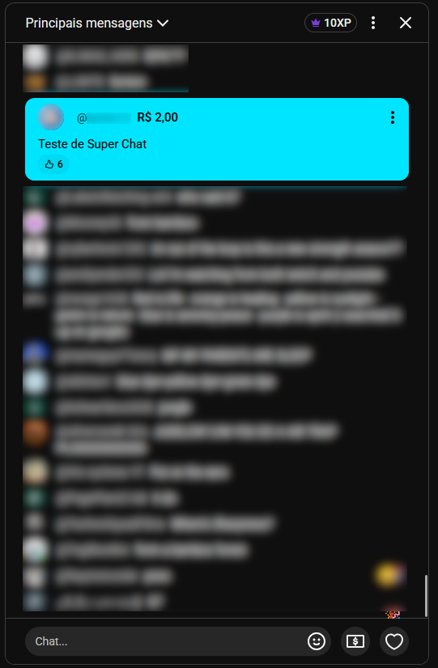

*Figura 26 — Chat com mensagem destacada de R$ 2,00 (cor azul), sem fixação no topo, com contagem de curtidas.*

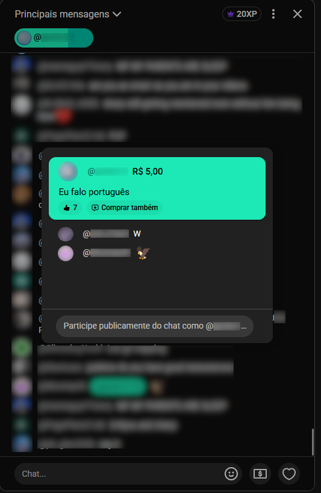

*Figura 27 — Chat com mensagem destacada de R$ 5,00 fixada no topo (cor verde) — primeira faixa de valor com fixação —, com opção de compra imediata e mensagens de resposta à mensagem fixada exibidas abaixo (thread).*

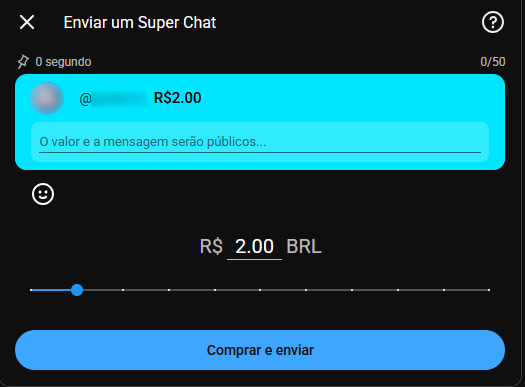

*Figura 28 — Modal de envio, faixa R$ 2,00: limite de 50 caracteres, fixação por 0 segundo (sem persistência no topo), destaque azul.*

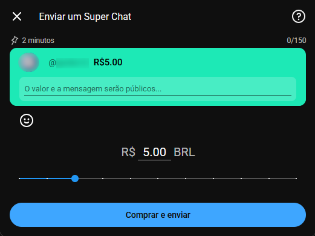

*Figura 29 — Modal de envio, faixa R$ 5,00: limite de 150 caracteres, fixação por 2 minutos, destaque verde.*

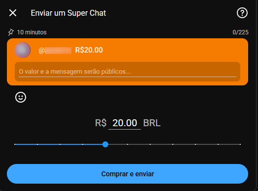

*Figura 30 — Modal de envio, faixa R$ 20,00: limite de 225 caracteres, fixação por 10 minutos, destaque laranja.*

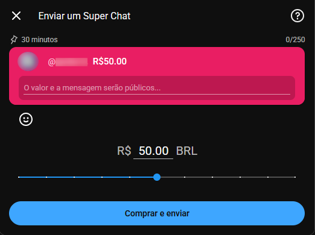

*Figura 31 — Modal de envio, faixa R$ 50,00: limite de 250 caracteres, fixação por 30 minutos, destaque rosa.*

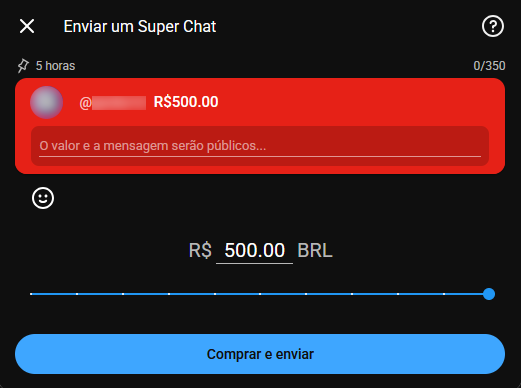

*Figura 32 — Modal de envio, faixa R$ 500,00: limite de 350 caracteres, fixação por 5 horas, destaque vermelho.*

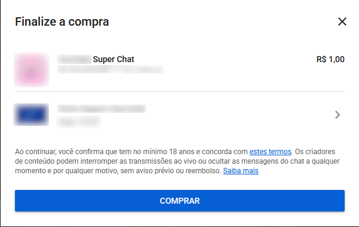

*Figura 33 — Checkout de finalização: confirmação de idade mínima de 18 anos, aceite de termos, opção de trocar o método de pagamento e aviso de que o criador pode interromper a transmissão ou ocultar mensagens do chat a qualquer momento, sem aviso prévio ou reembolso.*

### 3.2 Parte B — Monetização e repasse ao criador

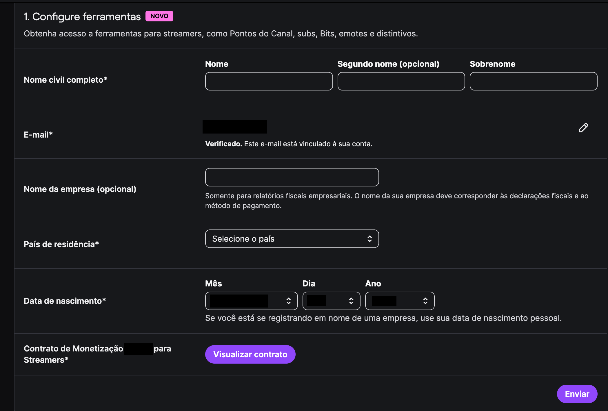

*Figura 34 — Etapa 1 do cadastro de monetização, em branco: nome civil, e-mail verificado, nome de empresa (opcional, para fins fiscais), país de residência, data de nascimento e aceite obrigatório do contrato de monetização. Dados pessoais e nome da plataforma tarjados. Autor: Davi Severiano Freitas, 16/09/2026.*

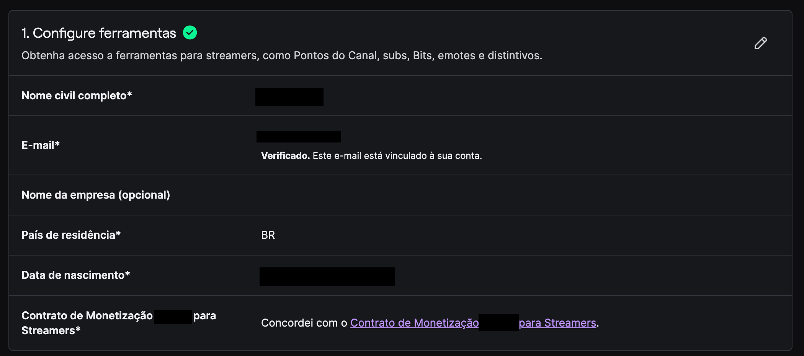

*Figura 35 — Mesma etapa após o envio, marcada como concluída e com os dados em modo de leitura, editáveis pelo ícone de lápis. Autor: Davi Severiano Freitas, 16/09/2026.*

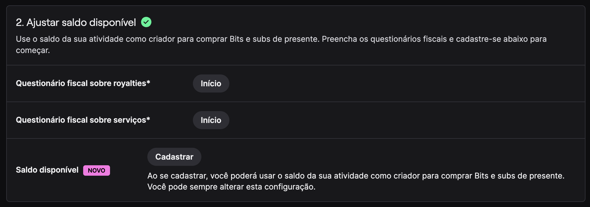

*Figura 36 — Etapa 2 do cadastro: dois questionários fiscais obrigatórios (royalties e serviços) e adesão ao saldo disponível, que permite gastar os ganhos em compras dentro da própria plataforma. Autor: Davi Severiano Freitas, 16/09/2026.*

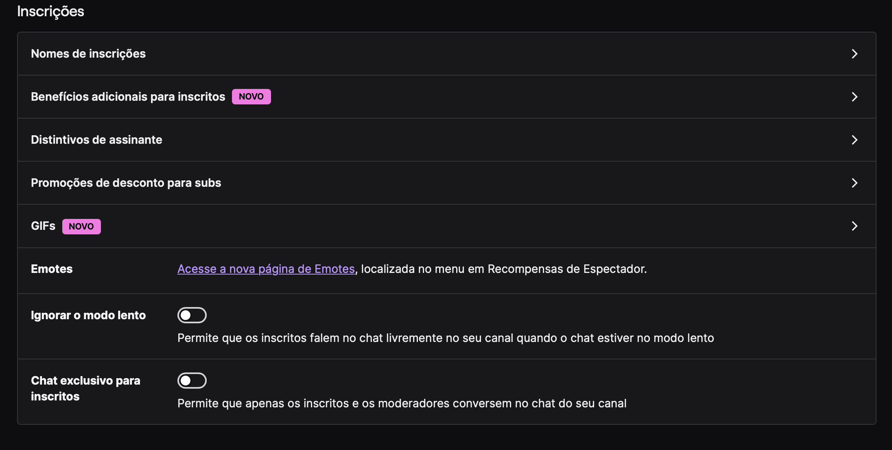

*Figura 37 — Ferramentas de inscrição liberadas após a conclusão do cadastro (nível 2): nomes de inscrição, benefícios adicionais, distintivos, promoções de desconto, emotes e controles de chat exclusivos para inscritos. Autor: Davi Severiano Freitas, 17/09/2026.*

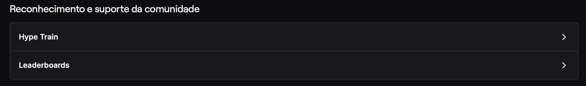

*Figura 38 — Ferramentas de reconhecimento da comunidade também liberadas no nível 2: mecanismo de engajamento coletivo e placares de apoiadores. Autor: Davi Severiano Freitas, 17/09/2026.*

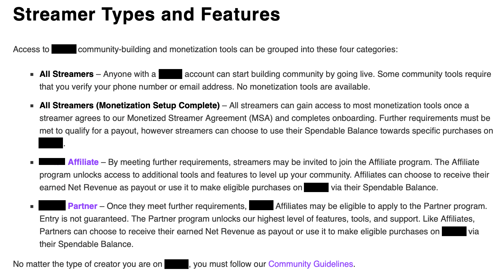

*Figura 39 — Documentação oficial (R04, R05): descrição das quatro categorias de criador (níveis 1 a 4), indicando que o nível 2 já libera a maior parte das ferramentas de monetização, que o repasse exige requisitos adicionais e que a entrada no nível 4 não é garantida. Nome da plataforma tarjado. Coleta: Davi Severiano Freitas, 17/09/2026.*

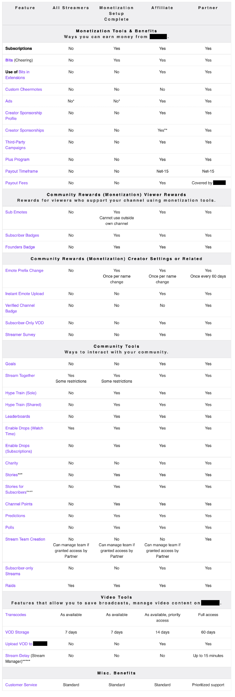

*Figura 40 — Documentação oficial (R05): tabela comparativa de recursos por categoria de criador, incluindo inscrições, moeda virtual, anúncios, prazo e taxas de repasse, recompensas de comunidade e ferramentas de vídeo. Coleta: Davi Severiano Freitas, 17/09/2026.*

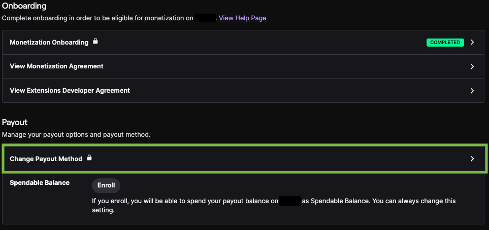

*Figura 41 — Documentação oficial (R04): seção de repasse no painel do criador, com o cadastro marcado como concluído, a alteração do método de pagamento sinalizada como acesso protegido (cadeado) e a adesão ao saldo disponível. Coleta: Davi Severiano Freitas, 17/09/2026.*

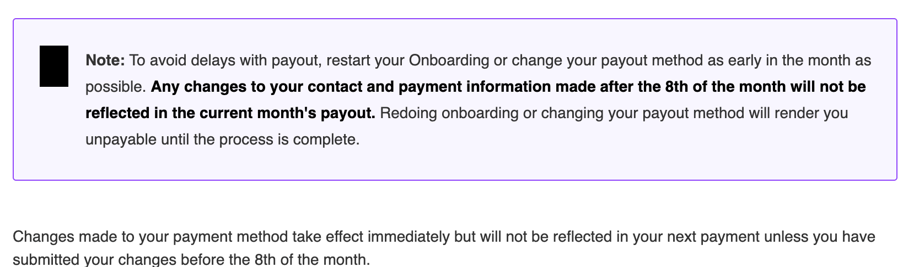

*Figura 42 — Documentação oficial (R04): aviso de que alterações nos dados de contato e de pagamento feitas após o dia 8 do mês não entram no repasse do mês corrente, e de que refazer o cadastro ou trocar o método torna o criador impagável até a conclusão do processo. Coleta: Davi Severiano Freitas, 17/09/2026.*

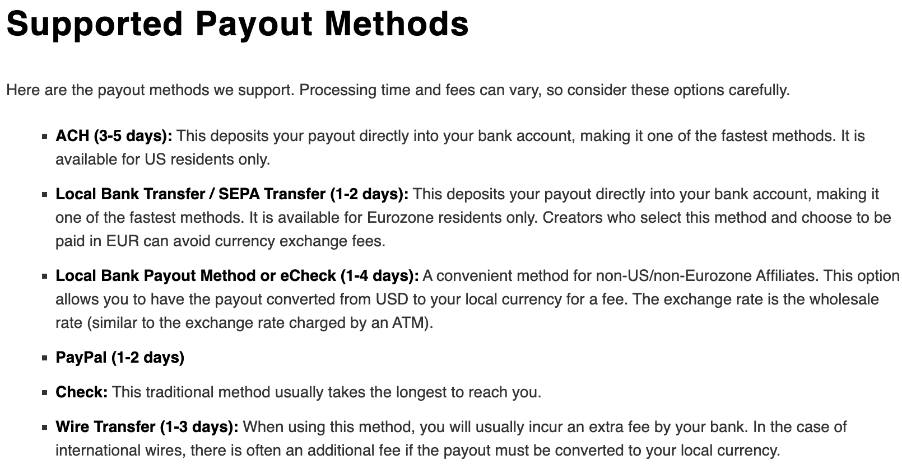

*Figura 43 — Documentação oficial (R04): métodos de repasse suportados, com prazos de processamento de 1 a 5 dias (e prazo indefinido, maior, para cheque em papel), restrições regionais por método e observações sobre conversão de moeda e taxas bancárias. Coleta: Davi Severiano Freitas, 17/09/2026.*

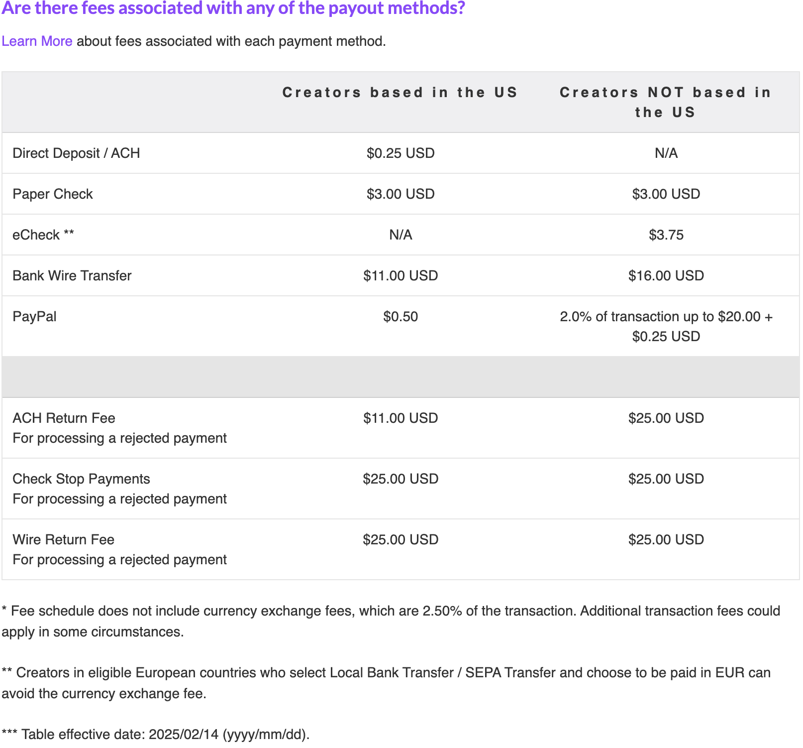

*Figura 44 — Documentação oficial (R04): tabela de taxas por método, separada entre criadores dos Estados Unidos e de fora, com linhas específicas de taxa por processamento de pagamento rejeitado e nota de taxa de conversão de moeda de 2,50%. Data de vigência da tabela na fonte: 14/02/2025. Coleta: Davi Severiano Freitas, 17/09/2026.*

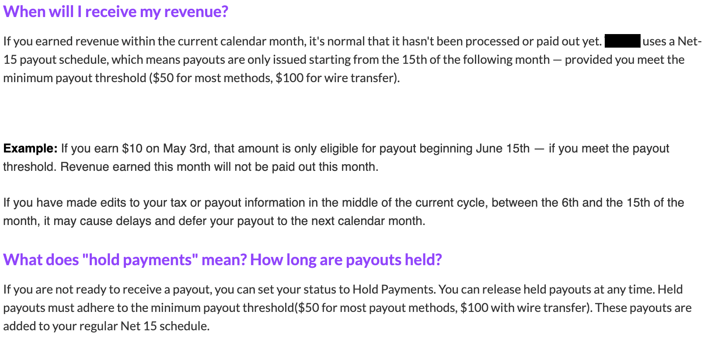

*Figura 45 — Documentação oficial (R04): calendário de repasse (ciclo Net-15, com emissão a partir do dia 15 do mês seguinte ao da receita), limites mínimos de US$ 50 para a maioria dos métodos e US$ 100 para transferência internacional, efeito de edições feitas entre os dias 6 e 15 do mês e funcionamento da retenção voluntária de pagamentos. Coleta: Davi Severiano Freitas, 17/09/2026.*

## 4. Achados

> Distinguir claramente **o que foi observado** do **o que foi inferido**. Achados apoiados em documentação oficial têm confiança alta; achados apoiados apenas em nomes de módulos têm confiança média. Valores monetários, prazos e datas de corte referem-se à documentação acessada em **17/09/2026** e podem ser alterados pela plataforma sem aviso.

### 4.1 Parte A — Mensagem paga destacada

| # | Achado inferido | Evidência | Grau de confiança |
| -- | -- | -- | -- |
| SC01 | O valor pago define uma faixa de destaque visual (cor), mas apenas a partir de R$ 5,00 a mensagem é fixada no topo do chat; o tempo de fixação cresce com o valor: R$ 2 → azul, sem fixação; R$ 5 → verde / 2 min; R$ 20 → laranja / 10 min; R$ 50 → rosa / 30 min; R$ 500 → vermelho / 5 h. | Figuras 26–32 | Alto |
| SC02 | O limite de caracteres da mensagem cresce junto com a faixa de valor (50 → 150 → 225 → 250 → 350). | Figuras 28–32 | Alto |
| SC03 | O checkout exige confirmação de idade mínima de 18 anos antes da compra. | Figura 33 | Alto |
| SC04 | O criador pode ocultar mensagens do chat ou encerrar a transmissão a qualquer momento, sem aviso prévio nem reembolso — condição explícita nos termos exibidos no checkout. | Figura 33 | Alto |
| SC05 | O checkout permite a troca do método de pagamento antes da confirmação da compra. | Figura 33 | Alto |
| SC06 | Após a mensagem ser fixada, outras mensagens do chat podem responder ou mencioná-la diretamente, formando uma thread visível logo abaixo dela. | Figura 27 | Alto |

### 4.2 Parte B — Habilitação da monetização

| # | Achado inferido | Evidência | Grau de confiança |
| -- | -- | -- | -- |
| SQ01 | A plataforma classifica os criadores em quatro categorias progressivas (níveis 1 a 4); o acesso às ferramentas de monetização e ao repasse cresce a cada nível. | Figuras 39–40 | Alto |
| SQ02 | A habilitação da monetização (nível 2) depende apenas de concluir o cadastro e aceitar o contrato, sem metas de audiência. O nível 3 exige convite e o nível 4 exige candidatura, sem garantia de entrada. | Figuras 39–40 | Alto |
| SQ03 | O cadastro de monetização exige nome civil, e-mail verificado, país de residência, data de nascimento e aceite do contrato, e pode ser editado depois. O nome de empresa é opcional e serve a relatórios fiscais empresariais. | Figuras 34–35 | Alto |
| SQ04 | Concluído o cadastro, são liberadas as ferramentas de inscrição (nomes, benefícios, distintivos, emotes, promoções e chat exclusivo) e as de reconhecimento da comunidade. | Figuras 37–38, 40 | Alto |
| SQ05 | A doação de moeda virtual é liberada já no nível 2; usos derivados, como aplicação da moeda em extensões (nível 3) e ícones personalizados de doação (nível 4), são restritos às categorias superiores. | Figura 40 | Alto |
| SQ06 | A veiculação de anúncios não é liberada nos níveis 1 e 2, apenas a partir do nível 3. | Figura 40 | Alto |
| SQ07 | Recursos não monetários também escalonam por categoria: retenção de gravações (7, 14 e 60 dias por nível), envio de vídeo, transmissão exclusiva para inscritos, atraso de transmissão e prioridade de atendimento. | Figura 40 | Alto |

### 4.3 Parte B — Repasse de ganhos

| # | Achado inferido | Evidência | Grau de confiança |
| -- | -- | -- | -- |
| SQ08 | Antes de ser qualificado ao repasse, o criador pode aderir ao saldo disponível e gastar os ganhos **dentro** da plataforma, comprando moeda virtual e inscrições de presente. | Figuras 36, 39, 41 | Alto |
| SQ09 | Só criadores dos níveis 3 e 4 podem receber o repasse em dinheiro; nos níveis inferiores o saldo acumulado fica restrito a compras internas. | Figuras 39–40; R03, seção 5.1 | Alto |
| SQ10 | O repasse segue um ciclo mensal fechado (Net-15): a receita de um mês só passa a ser elegível a partir do dia 15 do mês seguinte, de forma automática. | Figuras 40, 45; R03, seção 5.1 | Alto |
| SQ11 | O repasse só é emitido acima de um limite mínimo, que varia por método: US$ 50 para a maioria e US$ 100 para transferência internacional (dados de 17/09/2026). | Figura 45 | Alto |
| SQ12 | Os métodos de repasse variam por região e diferem em prazo de processamento (de 1 a 5 dias, sendo o cheque em papel o mais lento) e em custo, com taxas por transação, taxas por processamento de pagamento rejeitado (US$ 11 a US$ 25) e taxa de conversão de 2,50% quando o valor é convertido para a moeda local (tabela vigente na fonte desde 14/02/2025). | Figuras 43–44 | Alto |
| SQ13 | Alterações nos dados de contato ou de pagamento feitas após o dia 8 do mês não entram no repasse do mês corrente; edições feitas entre os dias 6 e 15 podem adiar o repasse para o mês seguinte. Enquanto o processo de alteração não se conclui, o criador fica impagável. | Figuras 42, 45; R03, seção 5.1 | Alto |
| SQ14 | O acesso à seção de repasse exige reautenticação por senha e autenticação em dois fatores — o que explica a indicação de acesso protegido na interface. | Figuras 41–42 | Alto |
| SQ15 | A interface possui módulos dedicados ao histórico de repasses e ao questionário fiscal, carregados sob demanda. | Inspeção de rede (nomes de módulos) | Médio |
| SQ16 | Sem a documentação fiscal completa, o pagamento é retido e pode haver retenção máxima de impostos na fonte. | Figura 36; R03, seções 5.1 e 5.2 | Alto |
| SQ17 | O criador pode reter o pagamento **voluntariamente**, alterando seu status, e liberar os valores retidos quando quiser; os valores liberados continuam sujeitos ao limite mínimo e entram no ciclo regular. | Figura 45 | Alto |
| SQ18 | A plataforma pode reter valores devidos em caso de violação dos termos, e os valores exibidos no painel são estimativas, não o valor final. | R03, seções 1.2 e 5.1 | Alto |

## 5. Decisões de Adaptação ao Escopo do Produto

A plataforma de referência possui quatro categorias de criador e um conjunto extenso de ferramentas de monetização. O produto da equipe adota uma simplificação deliberada, registrada aqui para rastreabilidade:

| Na `<plataforma>` | No produto da equipe | Justificativa |
| -- | -- | -- |
| Quatro categorias progressivas de criador (SQ01) | **Dois perfis**: criador monetizado e não monetizado | Reduz a complexidade preservando a regra essencial de elegibilidade; a fronteira adotada equivale à do nível 2, que é onde a plataforma passa a permitir o recebimento de doações |
| Ferramentas liberadas de forma escalonada (SQ04–SQ07) | Diferença única entre perfis: **somente o criador monetizado recebe doações de moeda virtual** | Mantém o foco nos processos da subequipe (monetização e chat) |
| Inscrições, anúncios, extensões, placares e demais recursos (SQ04–SQ07) | **Fora do escopo** | Não pertencem aos processos de Confiabilidade e Disponibilidade sob responsabilidade da subequipe |
| Doação de moeda virtual com mensagem no chat (SQ05) | **Mantida** — recurso central | Já modelada no diagrama de sequência de Doação |
| Mensagem paga destacada, observada na `<plataforma-B>` (SC01–SC06) | **Mantida**, mas paga com **moeda virtual**, e não com dinheiro | Unifica as duas formas de apoio sob a mesma carteira, evitando um segundo fluxo de checkout |
| Saldo do criador utilizável na própria plataforma (SQ08) | **Mantido**: o saldo em dinheiro do criador pode pagar a recarga de moeda virtual, sem processador externo | Reaproveita a carteira já modelada e explica como o criador volta a participar do ciclo de apoio |
| Repasse periódico automático com limite mínimo (SQ10–SQ13) | Mantido como processo de saída de valores do sistema, com prazos e limites **parametrizáveis** | Necessário para fechar o ciclo do dinheiro: entrada pela recarga, circulação pela doação e saída pelo repasse |
| Retenção voluntária do pagamento (SQ17) | **Fora do escopo inicial** | Registrada como evolução possível; não é necessária ao fluxo principal |

## 6. Rastreabilidade com a Modelagem

| Achado | Artefato impactado | Elemento do modelo |
| -- | -- | -- |
| SC01, SC02 | Diagrama de sequência — Doação | Faixa de destaque (cor, tempo de fixação, limite de caracteres) |
| SC03 | Diagrama de classes | Validação de idade mínima no perfil do usuário |
| SC04 | Diagrama de sequência — Doação | Notificação ao chat assíncrona, sem estorno em caso de remoção |
| SQ02, SQ09 | Diagramas de classes e de sequência — Doação e Repasse | Perfil de monetização do criador (monetizado / não monetizado) |
| SQ03 | Diagrama de classes | Dados civis e aceite do contrato como pré-condição da monetização |
| SQ05 | Diagrama de sequência — Doação | Verificação de que o destinatário está habilitado a receber |
| SQ08 | Diagrama de sequência — Recarga | Alternativa de pagamento com o saldo em dinheiro do criador, sem processador externo |
| SQ10, SQ11 | Diagrama de sequência — Repasse | Disparo periódico condicionado ao limite mínimo |
| SQ12 | Diagrama de classes | Método de pagamento cadastrado no perfil, com prazo e custo próprios |
| SQ13, SQ16 | Diagrama de sequência — Repasse | Retenção do repasse por dados incompletos ou alteração em vigência |
| SQ14 | Diagrama de classes | Operação sensível, sujeita a reautenticação |

## 7. Senso Crítico

**Parte A.** A `<plataforma-B>` cobra em dinheiro a cada mensagem destacada; o produto da equipe adapta o recurso para pagamento em moeda virtual, o que é decisão de modelagem e não comportamento observado. O checkout da Figura 33 exibe R$ 1,00, valor inferior ao da menor faixa registrada na Figura 28 (R$ 2,00); a diferença não foi investigada nesta coleta e pode decorrer de variação por canal ou por região.

**Parte B.** A engenharia reversa do repasse é **parcial** (completitude parcial, segundo Pressman e Maxim, 2016). O cadastro de monetização e a liberação das ferramentas foram observados diretamente na interface; já o repasse em si, cálculo, emissão e histórico, não pôde ser observado, pois exige conta qualificada com ganhos acumulados. As regras de pagamento provêm de documentação oficial e do contrato, e não do comportamento do sistema.

Há **divergência entre as fontes** em dois pontos. O contrato (R03) descreve o pagamento como mensal, em até 45 dias após o fim do mês, enquanto a documentação de repasse (R04) descreve um ciclo com emissão a partir do dia 15 do mês seguinte; o prazo de vigência das alterações de dados de pagamento também difere entre as duas fontes (15 dias úteis no contrato, contra dia de corte e prazo próprio em R04). Além disso, a própria tabela de taxas traz data de vigência anterior à da coleta, o que confirma que esses valores mudam. Por isso, a modelagem trata prazos, limites e taxas como **parâmetros configuráveis**, e não como constantes de domínio — os números registrados nos achados valem para o acesso de 17/09/2026.

Por fim, os requisitos de qualificação aos níveis 3 e 4 não foram verificados em conta própria, e a documentação consultada não os detalha nas páginas analisadas: permanecem como lacuna, pouco relevante para o escopo adotado, já que o produto reduz a distinção a dois perfis.

## 8. Participantes & Comprobatórios

| Membro | Contribuição | Comprobatório (commit/PR) |
| -- | -- | -- |
| Davi Severiano Freitas | Parte B: reestruturação da ER complementar (habilitação de monetização e repasse ao criador); evidências Figuras 34–45; metodologia, decisões de adaptação, rastreabilidade, senso crítico e referências; renomeação do Foco 04 para Extra | [Ata S2_03](/Projeto/Atas/Atas_Sg2/ata-S2-03-2026-09-16.md) · [`a5df84a`](https://github.com/UnBArqDsw2026-2-Turma01/2026.2-T01-_G6_ProjetoStreamingVideo_Entrega_02/commit/a5df84af92bda9f78a6ad8c6a0aede70a6640df1) · [`801143c`](https://github.com/UnBArqDsw2026-2-Turma01/2026.2-T01-_G6_ProjetoStreamingVideo_Entrega_02/commit/801143c10c12b233d39e1bbc44331b2849355040) · [`190c467`](https://github.com/UnBArqDsw2026-2-Turma01/2026.2-T01-_G6_ProjetoStreamingVideo_Entrega_02/commit/190c467752ae9e23add0a0e1a48a3d2fe737007c) |
| Mateus Rodrigues Barreto | Parte A: complemento da engenharia reversa com mensagem paga destacada (Super Chat; achados SC01–SC06; Figuras 26–33) | [`7d31399`](https://github.com/UnBArqDsw2026-2-Turma01/2026.2-T01-_G6_ProjetoStreamingVideo_Entrega_02/commit/7d31399db78b0711fe621eac17966668ff787e8a) · Histórico v1.1 |
| Pedro Henrique Freire Rodrigues | Uso da ER complementar como insumo à modelagem do módulo de Chat (sem commit próprio neste arquivo) | [Ata S2_02](/Projeto/Atas/Atas_Sg2/ata-S2-02-2026-09-14.md) · §2 do [índice](/Base/Relatórios/1.1.2.SubEquipe_02/README.md) |
| Daniel de Oliveira Lira | Uso da ER complementar como insumo à modelagem do módulo de Chat (sem commit próprio neste arquivo) | [Ata S2_02](/Projeto/Atas/Atas_Sg2/ata-S2-02-2026-09-14.md) · §2 do [índice](/Base/Relatórios/1.1.2.SubEquipe_02/README.md) |

## 9. Referências

- **R03**: `<plataforma>`. **Contrato de monetização para streamers**. Última modificação em 21 ago. 2026. Acesso em: 16 set. 2026.
- **R04**: `<plataforma>`. **Central de ajuda — detalhes de repasse (perguntas frequentes)**. Acesso em: 17 set. 2026.
- **R05**: `<plataforma>`. **Central de ajuda — tipos de criador e recursos por categoria**. Acesso em: 17 set. 2026.
- **R01**: PRESSMAN, Roger S.; MAXIM, Bruce R. **Engenharia de Software: uma abordagem profissional**. 8. ed. Porto Alegre: AMGH, 2016.

---

## Histórico de Versões

| Versão | Data | Descrição | Autor(es) | Revisor(es) |
| -- | -- | -- | -- | -- |
| 1.0 | 16/09/2026 | Criação do documento | Davi Severiano Freitas | |
| 1.1 | 16/09/2026 | Reescrita do documento e adição do fluxo de mensagem paga destacada | Mateus Rodrigues Barreto | |
| 1.2 | 17/09/2026 | Reestruturação em duas partes; engenharia reversa da habilitação de monetização e do repasse ao criador (Figuras 34–45); rótulos genéricos de categoria, metodologia, decisões de adaptação, rastreabilidade, senso crítico e referências | Davi Severiano Freitas | |
| 1.3 | 18/09/2026 | Atualização de Participantes & Comprobatórios com commits da Entrega 2 | Pedro Henrique Freire Rodrigues | |