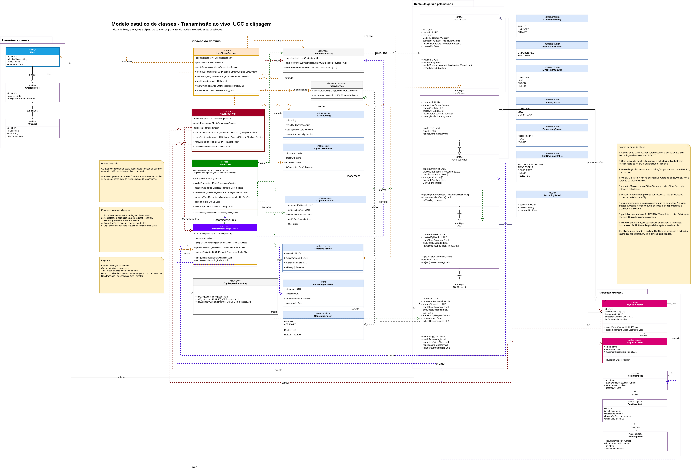
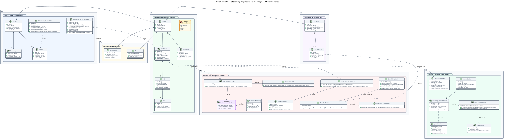

# Plataforma de Streaming de Vídeo — Entrega 02

Documentação do Grupo 06 para a segunda entrega da disciplina **Arquitetura e Desenho de Software** da Universidade de Brasília. Esta entrega apresenta a modelagem estática e dinâmica de uma plataforma de streaming de vídeo, além da análise crítica sobre o uso de IA Generativa durante a construção e a revisão dos artefatos.

**Código da Disciplina**: FGA0208<br>
**Número do Grupo**: 06<br>
**Entrega**: 02 — Desenho de Software (Modelagem)<br>

## Alunos

| Matrícula | Aluno |
| -- | -- |
| 24/1039645 | Lucas Andrade Zanetti |
| 24/1040350 | Philipe Amâncio Reis Caetano |
| 24/1011466 | Mateus Rodrigues Barreto |
| 24/1041302 | Hugo Freitas Silva |
| 24/1011027 | Eduardo Lôbo Moreira |
| 23/1026545 | Pedro Henrique Freire Rodrigues |
| 24/1039073 | Heitor Macedo Ricardo |
| 24/1031852 | Matheus Lemes Amaral |
| 24/1040332 | Pedro Druck Montalvão Reis |
| 24/1011018 | Davi Severiano Freitas |
| 24/1025505 | Daniel de Oliveira Lira |

## Sobre

O projeto modela os principais domínios de uma plataforma de streaming de vídeo: transmissão ao vivo, conteúdo gerado pelo usuário, clipagem, reprodução, chat, monetização, autenticação, moderação e telemetria. O trabalho foi dividido entre três subequipes, cada uma responsável por um conjunto de módulos e pelos três focos obrigatórios da entrega:

- **Modelagem Estática:** diagramas estruturais em notação UML;
- **Modelagem Dinâmica:** diagramas comportamentais em notação UML;
- **IA Generativa:** pontos de vista individuais, lições aprendidas e avaliação crítica do apoio de IA.

Os artefatos possuem registros de autoria, versionamento, decisões, referências e elos com evidências. A visão consolidada está disponível em [Desenho de Software — Modelagem](/Base/1.Modelagem.md), e o estado da entrega pode ser consultado no [Checklist](/Checklist.md).

## Screenshots da Segunda Entrega

### Modelo estático — Transmissão ao vivo, UGC, Clipagem e Reprodução



<p align="center"><sub><b>Figura 1</b> — Diagrama de classes integrado da Subequipe 01. <a href="Base/Relatórios/1.1.1.SubEquipe_01/1.1.1.1.Foco01.ModelagemEstatica.md">Consultar artefato e rastreabilidade</a>.</sub></p>

### Modelo estático — Monetização


<p align="center"><sub><b>Figura 2</b> — Diagrama de classes do módulo de Monetização da Subequipe 02. <a href="Base/Relatórios/1.1.2.SubEquipe_02/1.1.2.1.Foco01.ModelagemEstatica.md">Consultar artefato e decisões de modelagem</a>.</sub></p>

### Arquitetura integrada — Autenticação, Moderação e Telemetria



<p align="center"><sub><b>Figura 3</b> — Arquitetura estática integrada da Subequipe 03. <a href="Base/Relatórios/1.1.3.SubEquipe_03/1.1.3.1.Foco01.ModelagemEstatica.md">Consultar artefato e fundamentação</a>.</sub></p>

## Há algo a ser executado?

**Não.** A entrega é composta por documentação e diagramas publicados no GitHub Pages. Os arquivos-fonte editáveis disponíveis (`.drawio` e `.puml`) estão versionados junto aos respectivos artefatos.

Para visualizar o site localmente, pode-se usar qualquer servidor HTTP estático apontando para a pasta `docs/`, por exemplo:

```bash
python3 -m http.server 8000 --directory docs
```

## Informações Complementares

- [Relatórios das três subequipes](/Base/1.Modelagem.md)
- [Participações individuais e comprobatórios](/Base/1.2.ParticipacoesModelagem.md)
- [Iniciativas extras](/Base/1.3.IniciativasExtras.md)
- [Atas do projeto](/Projeto/Projeto.md)
